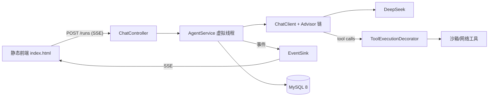

# deerflow-java

仓库：https://github.com/CuiZhiyu712/deer-lite

基于 **Spring AI 2.0** 的通用 Agent 运行时（对标 [DeerFlow](https://github.com/bytedance/deer-flow) 的 Java 实现）。
流式对话 · 多轮工具调用 · 沙箱执行 · SSE 事件时间线 · 会话持久化。

## 特性

- **Agent 循环**：ChatClient + Advisor 链，工具调用循环由 Spring AI 2.0 的 ToolCallingAdvisor 承载
- **8 个内置工具**：bash（超时/黑名单/输出截断）、read_file / write_file / str_replace / ls（工作区隔离、防路径穿越）、web_search（Tavily）、web_fetch（Jina）、write_todos
- **SSE 事件协议**：text_delta / tool_start / tool_result / todo_update / usage / run_end 等，前端实时渲染工具调用时间线
- **可中止**：中止运行并强杀正在执行的子进程；单 run 限额（工具轮次/时长/token）
- **持久化**：MySQL + JPA，历史消息与工具卡片可回溯；tool_calls 结构完整保存以保证历史重放合法
- **Java 21 虚拟线程**承载 SSE 长连接与 Agent 执行
- **配置化**：DeepSeek 默认（OpenAI 兼容协议），deerflow.models 可注册多 provider（GET /api/models）；未配置注册表时回退默认模型

## 架构



与 DeerFlow 的映射：LangGraph middleware ↔ Spring AI Advisor（+ToolCallback 装饰器）；checkpointer ↔ messages/runs 表重建；Sandbox ↔ WorkspaceManager + ShellRunner。详见 [docs/architecture.md](docs/architecture.md)。

## 快速开始

```bash
docker compose up -d            # MySQL 8
./mvnw spring-boot:run -Dspring-boot.run.profiles=local
# 浏览器打开 http://localhost:8080
```

MySQL 由 `docker-compose.yml` 提供（端口 3307，因本机 3306 常被占用）。

首次使用复制 `application-local.yml.example` 为 `src/main/resources/application-local.yml` 并填入 `spring.ai.openai.api-key`（DeepSeek）。web_search/web_fetch 需要 `TAVILY_API_KEY` / JINA 服务可达。

## 示例任务（演示脚本）

- 「写一个 hello.py 并运行它」→ write_file → bash，全程流式可见
- 「搜索 Spring AI 2.0 的 Advisor 新特性并总结」→ web_search → web_fetch → 汇总

## 测试

```bash
./mvnw test        # 单元 + 集成测试（含 *IT；H2，无需 Docker）
```

## Roadmap

- [x] M1：MVP（本 README 所述全部特性）
- [x] 多模型注册表（`deerflow.models` 配置多 provider，`GET /api/models`）
- [ ] M2：长期记忆（提取/检索注入）、LLM 摘要压缩、Skills（SKILL.md，复用 DeerFlow 技能包）、澄清式人机交互
- [ ] M3：Docker 容器沙箱、Subagent 委派、MCP 接入

## Non-goals

多用户/鉴权、IM 渠道、定时任务、K8s、多实例水平扩展。

## 安全说明

MVP 沙箱为**本机受限执行**（工作区隔离 + 命令黑名单 + 超时），并非安全隔离边界；请勿在共享/敏感机器上开放访问。二期计划 Docker 容器沙箱。
