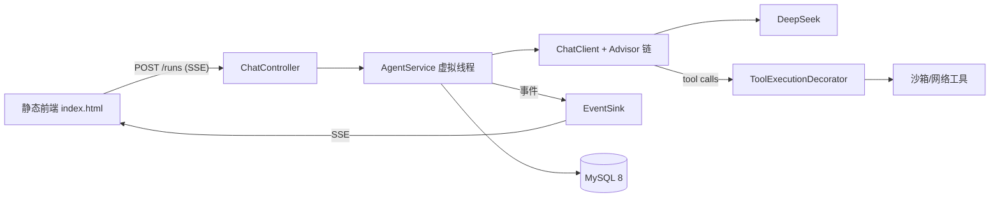

# deerflow-java M0+M1 实施计划

> **For agentic workers:** REQUIRED SUB-SKILL: Use superpowers:subagent-driven-development (recommended) or superpowers:executing-plans to implement this plan task-by-task. Steps use checkbox (`- [ ]`) syntax for tracking.

**Goal:** 用 Spring AI 2.0 构建一个 DeerFlow 风格的 Agent 运行时 MVP：流式对话 + 沙箱工具 + SSE 事件时间线 + 持久化 + 单页前端。

**Architecture:** ChatClient + Advisor 链（官方 ToolCallingAdvisor 承载工具循环），自研集中在 SSE 事件协议、沙箱执行器、会话持久化。每 run 一个虚拟线程，SseEmitter 逐事件推送。

**Tech Stack:** Java 21 / Spring Boot 4.1.1 / Spring AI 2.0.1（BOM） / MySQL 8(Docker) + JPA / DeepSeek(OpenAI 兼容) / 原生 HTML+JS。

**Spec:** `docs/superpowers/specs/2026-10-05-deerflow-java-design.md`

**执行环境注意（Windows + git-bash）**：所有命令在 git-bash 中运行；`./mvnw` 代替 `mvn`；curl 为 git-bash 自带。**依赖版本若 2.0.1 不存在，回退 2.0.0**（改 `pom.xml` 属性一处即可）。

**验证纪律（重要）**：本计划基于 Spring AI 2.0 官方文档编写，但个别 API 细节（Usage 字段名、ToolCallingAdvisor 暴露的事件）需在 Task 3/4 spike 中用编译器实测校准。**当编译或运行报 API 不符时，以实际 JAR 为准修正代码，并在 `docs/spike-notes.md` 记录**，不要猜测。

---

## 文件结构总览

```
deerflow-java/
├── pom.xml                                     # T1
├── docker-compose.yml                          # T2
├── .env.example / application-local.yml.example# T19
├── .github/workflows/ci.yml                    # T24
├── docs/spike-notes.md                         # T4
├── docs/architecture.md / resume.md / README.md# T22/T23
├── src/main/java/com/deerflow/
│   ├── DeerflowJavaApplication.java            # T1
│   ├── config/AiConfig.java                    # T3/T20
│   ├── config/AppProperties.java               # T13
│   ├── demo/DemoController.java                # T3（M0 spike 用，M1 完可删）
│   ├── event/AgentEvent.java                   # T7
│   ├── event/EventSink.java                    # T7
│   ├── sandbox/WorkspaceManager.java           # T8
│   ├── sandbox/ShellRunner.java                # T10
│   ├── sandbox/SandboxSecurityException.java   # T8
│   ├── tool/FileTools.java                     # T9
│   ├── tool/BashTool.java                      # T10
│   ├── tool/ToolExecutionDecorator.java        # T11
│   ├── tool/WebSearchTool.java / WebFetchTool.java # T12
│   ├── tool/TodoTool.java                      # T18
│   ├── agent/advisors/ContextAssemblyAdvisor.java  # T13
│   ├── agent/advisors/TokenBudgetAdvisor.java      # T13
│   ├── agent/advisors/UsageTrackingAdvisor.java    # T13
│   ├── agent/PromptBuilder.java                # T13
│   ├── agent/MessageConverter.java             # T14
│   ├── agent/AgentService.java                 # T15/T16
│   ├── chat/ChatController.java                # T17
│   ├── chat/dto/*.java                         # T17
│   └── persistence/{ChatSession,MessageEntity,Run}*.java # T6
├── src/main/resources/
│   ├── application.yml                         # T1
│   ├── prompts/system.st                       # T13
│   └── static/index.html                       # T21（单文件含 CSS/JS）
└── src/test/...                                # 跟随各任务
```

---

# M0：地基（~1 周）

### Task 1: 项目骨架与构建

**Files:**
- Create: `pom.xml`、`src/main/java/com/deerflow/DeerflowJavaApplication.java`、`src/main/resources/application.yml`
- Copy: `mvnw`、`mvnw.cmd`、`.mvn/`（来自 start.spring.io，本机无 mvn）

- [ ] **Step 1: 从 start.spring.io 获取 Maven Wrapper**

```bash
cd /d/JAVA_Projects/deerflow-java
curl -s "https://start.spring.io/starter.tgz?type=maven-project&language=java&bootVersion=4.1.1&javaVersion=21&groupId=com.deerflow&artifactId=deerflow-java&name=deerflow-java&packageName=com.deerflow&packaging=jar&dependencies=web,data-jpa,mysql" -o /tmp/starter.tgz
mkdir -p /tmp/starter && tar -xzf /tmp/starter.tgz -C /tmp/starter
cp -r /tmp/starter/mvnw /tmp/starter/mvnw.cmd /tmp/starter/.mvn .
chmod +x mvnw
./mvnw -v
```
Expected: 输出 Maven 3.9.x + Java 21。若 `bootVersion=4.1.1` 被拒（返回 HTML 错误），去掉该参数重试（取默认最新版），并在 pom 中手动写 4.1.1。

- [ ] **Step 2: 写入 pom.xml（覆盖生成物）**

```xml
<?xml version="1.0" encoding="UTF-8"?>
<project xmlns="http://maven.apache.org/POM/4.0.0"
         xmlns:xsi="http://www.w3.org/2001/XMLSchema-instance"
         xsi:schemaLocation="http://maven.apache.org/POM/4.0.0 https://maven.apache.org/xsd/maven-4.0.0.xsd">
  <modelVersion>4.0.0</modelVersion>
  <parent>
    <groupId>org.springframework.boot</groupId>
    <artifactId>spring-boot-starter-parent</artifactId>
    <version>4.1.1</version>
    <relativePath/>
  </parent>
  <groupId>com.deerflow</groupId>
  <artifactId>deerflow-java</artifactId>
  <version>0.1.0-SNAPSHOT</version>
  <name>deerflow-java</name>
  <description>Spring AI agent runtime inspired by DeerFlow</description>
  <properties>
    <java.version>21</java.version>
    <spring-ai.version>2.0.1</spring-ai.version>
  </properties>
  <dependencyManagement>
    <dependencies>
      <dependency>
        <groupId>org.springframework.ai</groupId>
        <artifactId>spring-ai-bom</artifactId>
        <version>${spring-ai.version}</version>
        <type>pom</type>
        <scope>import</scope>
      </dependency>
    </dependencies>
  </dependencyManagement>
  <dependencies>
    <dependency><groupId>org.springframework.boot</groupId><artifactId>spring-boot-starter-web</artifactId></dependency>
    <dependency><groupId>org.springframework.boot</groupId><artifactId>spring-boot-starter-data-jpa</artifactId></dependency>
    <dependency><groupId>org.springframework.boot</groupId><artifactId>spring-boot-starter-actuator</artifactId></dependency>
    <dependency><groupId>com.mysql</groupId><artifactId>mysql-connector-j</artifactId><scope>runtime</scope></dependency>
    <dependency><groupId>org.springframework.ai</groupId><artifactId>spring-ai-starter-model-openai</artifactId></dependency>
    <dependency><groupId>org.springframework.boot</groupId><artifactId>spring-boot-starter-test</artifactId><scope>test</scope></dependency>
    <dependency><groupId>com.h2database</groupId><artifactId>h2</artifactId><scope>test</scope></dependency>
  </dependencies>
  <build>
    <plugins>
      <plugin><groupId>org.springframework.boot</groupId><artifactId>spring-boot-maven-plugin</artifactId></plugin>
    </plugins>
  </build>
</project>
```

- [ ] **Step 3: 主类与配置**

`src/main/java/com/deerflow/DeerflowJavaApplication.java`：
```java
package com.deerflow;

import org.springframework.boot.SpringApplication;
import org.springframework.boot.autoconfigure.SpringBootApplication;

@SpringBootApplication
public class DeerflowJavaApplication {
    public static void main(String[] args) {
        SpringApplication.run(DeerflowJavaApplication.class, args);
    }
}
```

`src/main/resources/application.yml`：
```yaml
spring:
  application:
    name: deerflow-java
  threads:
    virtual:
      enabled: true
  datasource:
    url: jdbc:mysql://localhost:3306/deerflow?useSSL=false&serverTimezone=UTC&characterEncoding=utf8
    username: root
    password: deerflow
  jpa:
    hibernate:
      ddl-auto: update
    open-in-view: false
  ai:
    openai:
      api-key: ${DEEPSEEK_API_KEY:missing-key-tell-user}
      base-url: https://api.deepseek.com
      chat:
        options:
          model: deepseek-chat

deerflow:
  sandbox:
    root: ./workspace
    timeout-seconds: 30
    max-output-bytes: 262144
  limits:
    max-tool-rounds: 40
    max-run-seconds: 600
    max-run-tokens: 200000

server:
  port: 8080
```

- [ ] **Step 4: 编译验证**

Run: `./mvnw -q compile`
Expected: BUILD SUCCESS（首次会下载依赖，较慢）。

- [ ] **Step 5: Commit**

```bash
git add pom.xml mvnw mvnw.cmd .mvn src
git commit -m "chore: bootstrap Spring Boot 4.1.1 + Spring AI 2.0 project skeleton"
```

---

### Task 2: MySQL 一键启动

**Files:**
- Create: `docker-compose.yml`

- [ ] **Step 1: 写 docker-compose.yml**

```yaml
services:
  mysql:
    image: mysql:8.4
    container_name: deerflow-mysql
    environment:
      MYSQL_ROOT_PASSWORD: deerflow
      MYSQL_DATABASE: deerflow
    ports:
      - "127.0.0.1:3306:3306"
    volumes:
      - mysql-data:/var/lib/mysql
    command: --character-set-server=utf8mb4 --collation-server=utf8mb4_unicode_ci
    healthcheck:
      test: ["CMD", "mysqladmin", "ping", "-h", "127.0.0.1", "-pdeerflow"]
      interval: 5s
      timeout: 3s
      retries: 20

volumes:
  mysql-data:
```

- [ ] **Step 2: 启动并验证**

```bash
docker compose up -d
docker compose ps          # STATUS 应为 healthy（等待 ~20s）
```
若 3306 被占用：改 ports 左侧为 `127.0.0.1:3307:3306` 并同步改 `application.yml` 数据源端口。

- [ ] **Step 3: Commit**

```bash
git add docker-compose.yml
git commit -m "chore: add MySQL 8 docker compose for local dev"
```

---

### Task 3: M0 Spike A —— DeepSeek 流式 SSE 打通

**风险点 R2/R3**：验证 DeepSeek 经 OpenAI 兼容协议的流式输出、Spring Boot 4 的 SSE 端点。

**Files:**
- Create: `src/main/java/com/deerflow/config/AiConfig.java`、`src/main/java/com/deerflow/demo/DemoController.java`

- [ ] **Step 1: ChatClient Bean 与演示端点**

`AiConfig.java`：
```java
package com.deerflow.config;

import org.springframework.ai.chat.client.ChatClient;
import org.springframework.context.annotation.Bean;
import org.springframework.context.annotation.Configuration;

@Configuration
public class AiConfig {

    @Bean
    ChatClient chatClient(ChatClient.Builder builder) {
        return builder.build();
    }
}
```

`DemoController.java`：
```java
package com.deerflow.demo;

import org.springframework.ai.chat.client.ChatClient;
import org.springframework.http.MediaType;
import org.springframework.web.bind.annotation.GetMapping;
import org.springframework.web.bind.annotation.RequestParam;
import org.springframework.web.bind.annotation.RestController;
import reactor.core.publisher.Flux;

@RestController
public class DemoController {

    private final ChatClient chatClient;

    public DemoController(ChatClient chatClient) {
        this.chatClient = chatClient;
    }

    @GetMapping(value = "/api/demo/stream", produces = MediaType.TEXT_EVENT_STREAM_VALUE)
    public Flux<String> stream(@RequestParam String q) {
        return chatClient.prompt().user(q).stream().content();
    }
}
```

- [ ] **Step 2: 配置 DeepSeek key 并启动**

```bash
# 方式一（临时）：export DEEPSEEK_API_KEY=sk-xxx
# 方式二（推荐，后续沿用）：
cat > src/main/resources/application-local.yml <<'EOF'
spring:
  ai:
    openai:
      api-key: sk-你的DeepSeekKey
EOF
./mvnw spring-boot:run -Dspring-boot.run.profiles=local
```
注意：`application-local.yml` 已被 .gitignore 忽略，勿提交。

- [ ] **Step 3: curl 验证流式**

```bash
curl -N "http://localhost:8080/api/demo/stream?q=用一句话介绍你自己"
```
Expected: `data:` 行持续逐段输出，最终结束。**记录：SSE 格式是否符合预期（data: 前缀、分块粒度）到 docs/spike-notes.md**。

- [ ] **Step 4: Commit**

```bash
git add src/main/java/com/deerflow/config/AiConfig.java src/main/java/com/deerflow/demo/DemoController.java
git commit -m "feat: streaming SSE demo endpoint wired to DeepSeek via OpenAI-compatible API"
```

---

### Task 4: M0 Spike B —— 工具循环 + 装饰器可观测性

**风险点 R1（最关键）**：2.0 中工具循环在 ChatClient 内部（ToolCallingAdvisor），需实测两件事：
1. DeepSeek 流式下的多轮 tool call 是否正常（R2）；
2. **外层 stream 能看到什么**：是否暴露中间 AssistantMessage(toolCalls)/ToolResponseMessage——决定事件发射与持久化策略（默认策略：自研 ToolCallback 装饰器发事件 + 从装饰器数据重建持久化，不依赖框架暴露）。

**Files:**
- Create: `src/main/java/com/deerflow/tool/ToolExecutionDecorator.java`（正式版雏形）、`docs/spike-notes.md`
- Modify: `src/main/java/com/deerflow/demo/DemoController.java`

- [ ] **Step 1: 工具装饰器雏形**

```java
package com.deerflow.tool;

import org.springframework.ai.chat.model.ToolContext;
import org.springframework.ai.tool.ToolCallback;
import org.springframework.ai.tool.definition.ToolDefinition;
import org.slf4j.Logger;
import org.slf4j.LoggerFactory;

/** M0 雏形：仅日志观察；M1 Task 11 换为正式版（SSE 事件+错误恢复+计数） */
public class ToolExecutionDecorator implements ToolCallback {

    private static final Logger log = LoggerFactory.getLogger(ToolExecutionDecorator.class);
    private final ToolCallback delegate;

    public ToolExecutionDecorator(ToolCallback delegate) {
        this.delegate = delegate;
    }

    @Override
    public ToolDefinition getToolDefinition() {
        return delegate.getToolDefinition();
    }

    @Override
    public String call(String toolInput) {
        return call(toolInput, null);
    }

    @Override
    public String call(String toolInput, ToolContext toolContext) {
        long t0 = System.currentTimeMillis();
        log.info("[SPIKE] tool_start name={} args={}", getToolDefinition().name(), toolInput);
        try {
            String out = delegate.call(toolInput, toolContext);
            log.info("[SPIKE] tool_result name={} ok=true ms={} out={}", getToolDefinition().name(), System.currentTimeMillis() - t0, preview(out));
            return out;
        } catch (Exception e) {
            log.warn("[SPIKE] tool_result name={} ok=false err={}", getToolDefinition().name(), e.getMessage());
            throw e;
        }
    }

    private static String preview(String s) {
        return s == null ? "null" : s.substring(0, Math.min(200, s.length()));
    }
}
```

- [ ] **Step 2: 演示工具 + 接线**

在 `AiConfig` 中新增：
```java
@Bean
org.springframework.ai.tool.ToolCallback timeTool() {
    var method = org.springframework.util.ReflectionUtils.findMethod(TimeTools.class, "now");
    return new ToolExecutionDecorator(org.springframework.ai.tool.method.MethodToolCallback
            .builder()
            .toolDefinition(org.springframework.ai.tool.definition.ToolDefinition.builder(method)
                    .description("获取当前服务器时间")
                    .build())
            .toolMethod(method)
            .toolObject(new TimeTools())
            .build());
}

static class TimeTools {
    public String now() {
        return java.time.OffsetDateTime.now().toString();
    }
}
```

`DemoController.stream` 加 `.toolCallbacks(timeTool)`：
```java
    public Flux<String> stream(@RequestParam String q) {
        return chatClient.prompt().user(q)
                .toolCallbacks(timeTool)
                .stream().content();
    }
```
（DemoController 构造器注入 `ToolCallback timeTool` 一并传入。）

- [ ] **Step 3: 运行验证（两条 curl）**

```bash
./mvnw spring-boot:run -Dspring-boot.run.profiles=local
# 终端 2：
curl -N "http://localhost:8080/api/demo/stream?q=现在几点了？必须调用工具查询"
```
Expected（关键观察）：
1. 日志出现 `[SPIKE] tool_start` 与 `tool_result`（装饰器被框架调用 → 装饰器方案可行）；
2. 模型在工具结果后继续输出最终回答（多轮循环正常）；
3. 注意 curl 输出中是否能看到工具调用中间的文本/结构。
4. 再测一条纯文本问题回归（工具不影响普通对话）。

- [ ] **Step 4: 记录 spike 结论到 docs/spike-notes.md**

```markdown
# M0 Spike 结论（Task 3/4）

- DeepSeek 流式：通过（SSE data 格式；分块粒度 __）
- 流式多轮 tool call：通过/异常（现象：__）
- 装饰器可观测性：框架调用装饰器 call() ✓ → 事件发射与持久化采用「装饰器重建」策略
- 外层 stream 暴露内容：__（是否含 toolCall 中间态）
- API 偏差修正记录（实际 JAR vs 计划代码差异）：__
- Usage 字段名实测：__（getPromptTokens/getCompletionTokens 或 getInputTokens/getOutputTokens）
```

- [ ] **Step 5: Commit**

```bash
git add src/main/java/com/deerflow/tool/ToolExecutionDecorator.java src/main/java/com/deerflow/config/AiConfig.java src/main/java/com/deerflow/demo/DemoController.java docs/spike-notes.md
git commit -m "feat(m0): tool-calling spike with observable ToolCallback decorator"
```

---

### Task 5: M0 收尾 —— 推 GitHub

- [ ] **Step 1: 创建远程仓库并推送**

```bash
gh auth status || echo "未登录 gh：先执行 gh auth login（浏览器授权）"
gh repo create deerflow-java --public --source=. --push
```
若不想用 gh：在 GitHub 网页新建空仓库后：
```bash
git remote add origin git@github.com:<你的用户名>/deerflow-java.git
git push -u origin main
```

- [ ] **Step 2: 若 spike 发现 API 偏差，更新 spec 的 §10 风险表**（标注 R1/R2 结论：已验证/需规避），提交。

```bash
git add docs && git commit -m "docs: record M0 spike results"
```

---

# M1：MVP（~1.5-2 周）

> 以下 TDD：先写失败测试 → 跑失败 → 实现 → 跑通过 → 提交。测试统一命令格式 `./mvnw -q -Dtest=类名 test`。

### Task 6: JPA 数据层（sessions / messages / runs）

**Files:**
- Create: `src/main/java/com/deerflow/persistence/ChatSession.java`、`MessageEntity.java`、`Run.java`、`ChatSessionRepository.java`、`MessageRepository.java`、`RunRepository.java`
- Create: `src/test/resources/application-test.yml`、`src/test/java/com/deerflow/persistence/RepositoryTest.java`

- [ ] **Step 1: 测试配置（H2，MySQL 兼容模式，测试不依赖 Docker）**

`src/test/resources/application-test.yml`：
```yaml
spring:
  datasource:
    url: jdbc:h2:mem:testdb;MODE=MySQL;DB_CLOSE_DELAY=-1
    driver-class-name: org.h2.Driver
    username: sa
    password:
  jpa:
    hibernate:
      ddl-auto: create-drop
```

- [ ] **Step 2: 写失败测试**

`RepositoryTest.java`：
```java
package com.deerflow.persistence;

import org.junit.jupiter.api.Test;
import org.springframework.beans.factory.annotation.Autowired;
import org.springframework.boot.test.autoconfigure.orm.jpa.DataJpaTest;
import org.springframework.test.context.ActiveProfiles;

import java.time.Instant;
import java.util.List;

import static org.assertj.core.api.Assertions.assertThat;

@DataJpaTest
@ActiveProfiles("test")
class RepositoryTest {

    @Autowired ChatSessionRepository sessionRepo;
    @Autowired MessageRepository messageRepo;
    @Autowired RunRepository runRepo;

    @Test
    void roundTripSessionMessageRun() {
        var session = new ChatSession("s1", "测试会话", "deepseek-chat", Instant.now());
        sessionRepo.save(session);

        messageRepo.save(new MessageEntity("m1", "s1", 0, "USER", "你好", null, null, null, Instant.now()));
        messageRepo.save(new MessageEntity("m2", "s1", 1, "ASSISTANT", "你好！", null, null, null, Instant.now()));

        var run = new Run("r1", "s1", "DONE", "你好", null, 10L, 20L, Instant.now(), Instant.now());
        runRepo.save(run);

        assertThat(sessionRepo.findById("s1")).isPresent();
        List<MessageEntity> msgs = messageRepo.findBySessionIdOrderBySeqAsc("s1");
        assertThat(msgs).hasSize(2);
        assertThat(msgs.get(1).getRole()).isEqualTo("ASSISTANT");
        assertThat(runRepo.findBySessionIdOrderByStartedAtDesc("s1")).hasSize(1);
    }
}
```

- [ ] **Step 3: 跑测试确认失败**

Run: `./mvnw -q -Dtest=RepositoryTest test`
Expected: 编译失败（类不存在）。

- [ ] **Step 4: 实现实体与仓库**

`ChatSession.java`：
```java
package com.deerflow.persistence;

import jakarta.persistence.*;
import java.time.Instant;

@Entity
@Table(name = "sessions")
public class ChatSession {
    @Id
    private String id;
    private String title;
    private String model;
    @Column(columnDefinition = "TEXT")
    private String todosJson;
    private Instant createdAt;
    private Instant updatedAt;

    protected ChatSession() {}

    public ChatSession(String id, String title, String model, Instant createdAt) {
        this.id = id;
        this.title = title;
        this.model = model;
        this.createdAt = createdAt;
        this.updatedAt = createdAt;
    }

    public String getId() { return id; }
    public String getTitle() { return title; }
    public void setTitle(String title) { this.title = title; }
    public String getModel() { return model; }
    public void setModel(String model) { this.model = model; }
    public String getTodosJson() { return todosJson; }
    public void setTodosJson(String todosJson) { this.todosJson = todosJson; }
    public Instant getCreatedAt() { return createdAt; }
    public Instant getUpdatedAt() { return updatedAt; }
    public void touch() { this.updatedAt = Instant.now(); }
}
```

`MessageEntity.java`：
```java
package com.deerflow.persistence;

import jakarta.persistence.*;
import java.time.Instant;

@Entity
@Table(name = "messages", indexes = @Index(name = "idx_msg_session_seq", columnList = "sessionId,seq"))
public class MessageEntity {
    @Id
    private String id;
    @Column(nullable = false)
    private String sessionId;
    @Column(name = "seq", nullable = false)
    private int seq;
    @Column(nullable = false, length = 32)
    private String role;
    @Column(columnDefinition = "TEXT")
    private String content;
    @Column(columnDefinition = "TEXT")
    private String toolCallsJson;
    private String toolCallId;
    private String toolName;
    private Instant createdAt;

    protected MessageEntity() {}

    public MessageEntity(String id, String sessionId, int seq, String role, String content,
                         String toolCallsJson, String toolCallId, String toolName, Instant createdAt) {
        this.id = id; this.sessionId = sessionId; this.seq = seq; this.role = role;
        this.content = content; this.toolCallsJson = toolCallsJson;
        this.toolCallId = toolCallId; this.toolName = toolName; this.createdAt = createdAt;
    }

    public String getId() { return id; }
    public String getSessionId() { return sessionId; }
    public int getSeq() { return seq; }
    public String getRole() { return role; }
    public String getContent() { return content; }
    public String getToolCallsJson() { return toolCallsJson; }
    public String getToolCallId() { return toolCallId; }
    public String getToolName() { return toolName; }
    public Instant getCreatedAt() { return createdAt; }
}
```

`Run.java`：
```java
package com.deerflow.persistence;

import jakarta.persistence.*;
import java.time.Instant;

@Entity
@Table(name = "runs", indexes = @Index(name = "idx_run_session", columnList = "sessionId"))
public class Run {
    @Id
    private String id;
    @Column(nullable = false)
    private String sessionId;
    @Column(nullable = false, length = 32)
    private String status;   // RUNNING / DONE / FAILED / CANCELLED
    @Column(columnDefinition = "TEXT")
    private String input;
    @Column(columnDefinition = "TEXT")
    private String error;
    private Long inputTokens;
    private Long outputTokens;
    private Instant startedAt;
    private Instant endedAt;

    protected Run() {}

    public Run(String id, String sessionId, String status, String input, String error,
               Long inputTokens, Long outputTokens, Instant startedAt, Instant endedAt) {
        this.id = id; this.sessionId = sessionId; this.status = status; this.input = input;
        this.error = error; this.inputTokens = inputTokens; this.outputTokens = outputTokens;
        this.startedAt = startedAt; this.endedAt = endedAt;
    }

    public String getId() { return id; }
    public String getSessionId() { return sessionId; }
    public String getStatus() { return status; }
    public void setStatus(String status) { this.status = status; }
    public String getInput() { return input; }
    public String getError() { return error; }
    public void setError(String error) { this.error = error; }
    public Long getInputTokens() { return inputTokens; }
    public void setInputTokens(Long v) { this.inputTokens = v; }
    public Long getOutputTokens() { return outputTokens; }
    public void setOutputTokens(Long v) { this.outputTokens = v; }
    public Instant getStartedAt() { return startedAt; }
    public Instant getEndedAt() { return endedAt; }
    public void setEndedAt(Instant endedAt) { this.endedAt = endedAt; }
}
```

三个仓库接口：
```java
package com.deerflow.persistence;

import org.springframework.data.jpa.repository.JpaRepository;
import java.util.List;

public interface ChatSessionRepository extends JpaRepository<ChatSession, String> {
    List<ChatSession> findAllByOrderByUpdatedAtDesc();
}
```
```java
public interface MessageRepository extends JpaRepository<MessageEntity, String> {
    List<MessageEntity> findBySessionIdOrderBySeqAsc(String sessionId);
    long countBySessionId(String sessionId);
}
```
```java
public interface RunRepository extends JpaRepository<Run, String> {
    List<Run> findBySessionIdOrderByStartedAtDesc(String sessionId);
}
```

- [ ] **Step 5: 跑测试通过并提交**

Run: `./mvnw -q -Dtest=RepositoryTest test` → Expected: PASS
```bash
git add src/main/java/com/deerflow/persistence src/test
git commit -m "feat: JPA persistence layer (sessions/messages/runs)"
```

---

### Task 7: 事件模型与 SSE 发布器

**Files:**
- Create: `src/main/java/com/deerflow/event/AgentEvent.java`、`event/EventSink.java`
- Test: `src/test/java/com/deerflow/event/EventSinkTest.java`

- [ ] **Step 1: 写失败测试（用假 SseEmitter 收集事件名与 data）**

```java
package com.deerflow.event;

import org.junit.jupiter.api.Test;

import java.util.List;
import java.util.concurrent.CopyOnWriteArrayList;
import java.util.concurrent.atomic.AtomicBoolean;

import static org.assertj.core.api.Assertions.assertThat;

class EventSinkTest {

    /** 用 Mockito 假 emitter：真实走 send→emit 路径，验证顺序/关闭语义与 JSON 序列化。 */
    @Test
    void sendsEventsAndStopsAfterComplete() throws java.io.IOException {
        var emitter = org.mockito.Mockito.mock(org.springframework.web.servlet.mvc.method.annotation.SseEmitter.class);
        EventSink sink = new EventSink(emitter, new tools.jackson.databind.ObjectMapper());

        sink.send(new AgentEvent.TextDelta("你"));
        sink.send(new AgentEvent.RunEnd("done", null));
        org.mockito.Mockito.verify(emitter, org.mockito.Mockito.times(2))
                .send(org.mockito.ArgumentMatchers.any(org.springframework.web.servlet.mvc.method.annotation.SseEmitter.SseEventBuilder.class));
        org.mockito.Mockito.verify(emitter, org.mockito.Mockito.never()).complete();

        sink.complete();
        org.mockito.Mockito.verify(emitter).complete();
        assertThat(sink.isClosed()).isTrue();

        sink.send(new AgentEvent.TextDelta("ignored"));
        org.mockito.Mockito.verify(emitter, org.mockito.Mockito.times(2))
                .send(org.mockito.ArgumentMatchers.any(org.springframework.web.servlet.mvc.method.annotation.SseEmitter.SseEventBuilder.class));
    }

    @Test
    void serializesEventPayloadAsJson() throws java.io.IOException {
        var emitter = org.mockito.Mockito.mock(org.springframework.web.servlet.mvc.method.annotation.SseEmitter.class);
        EventSink sink = new EventSink(emitter, new tools.jackson.databind.ObjectMapper());
        sink.send(new AgentEvent.TextDelta("你"));

        var captor = org.mockito.ArgumentCaptor.forClass(org.springframework.web.servlet.mvc.method.annotation.SseEmitter.SseEventBuilder.class);
        org.mockito.Mockito.verify(emitter).send(captor.capture());
        String rendered = captor.getValue().build().toString();
        assertThat(rendered).contains("text_delta").contains("delta").contains("你");
    }
}
```
（注：SseEventBuilder.build() 的结果依赖 Spring 内部渲染，断言用 contains 保持稳健；若 build() 不可访问，改用 contains("你") 的替代验证并在报告中说明。）

- [ ] **Step 2: 实现 AgentEvent 与 EventSink**

`AgentEvent.java`：
```java
package com.deerflow.event;

import java.util.List;

public sealed interface AgentEvent {
    String type();

    record RunStart(String runId, String sessionId) implements AgentEvent {
        public String type() { return "run_start"; }
    }

    record TextDelta(String delta) implements AgentEvent {
        public String type() { return "text_delta"; }
    }

    record ToolStart(String id, String name, String argsPreview) implements AgentEvent {
        public String type() { return "tool_start"; }
    }

    record ToolResult(String id, String name, boolean ok, String outputPreview, long durationMs) implements AgentEvent {
        public String type() { return "tool_result"; }
    }

    record TodoUpdate(List<TodoItem> todos) implements AgentEvent {
        public String type() { return "todo_update"; }
    }

    record Usage(Long inputTokens, Long outputTokens) implements AgentEvent {
        public String type() { return "usage"; }
    }

    record RunEnd(String status, String error) implements AgentEvent {
        public String type() { return "run_end"; }
    }

    record Ping() implements AgentEvent {
        public String type() { return "ping"; }
    }

    record TodoItem(String content, String status) {}
}
```

`EventSink.java`：
```java
package com.deerflow.event;

import org.slf4j.Logger;
import org.slf4j.LoggerFactory;
import org.springframework.web.servlet.mvc.method.annotation.SseEmitter;
import tools.jackson.databind.ObjectMapper;

import java.util.concurrent.atomic.AtomicBoolean;

/**
 * 单次 run 的 SSE 出口。线程安全：run 虚拟线程与 ping 定时线程都会写。
 */
public class EventSink {

    private static final Logger log = LoggerFactory.getLogger(EventSink.class);

    private final SseEmitter emitter;
    private final ObjectMapper objectMapper;
    private final AtomicBoolean closed = new AtomicBoolean(false);

    public EventSink(SseEmitter emitter, ObjectMapper objectMapper) {
        this.emitter = emitter;
        this.objectMapper = objectMapper;
    }

    public void send(AgentEvent event) {
        if (closed.get()) {
            return;
        }
        try {
            String json = objectMapper.writeValueAsString(event);
            emit(event.type(), json);
        } catch (Exception e) {
            markBroken();
        }
    }

    /** 便于测试覆写。 */
    protected void emit(String name, Object data) throws Exception {
        synchronized (this) {
            emitter.send(SseEmitter.event().name(name).data(data));
        }
    }

    public synchronized void complete() {
        if (closed.compareAndSet(false, true)) {
            emitter.complete();
        }
    }

    public void fail(Throwable t) {
        if (closed.compareAndSet(false, true)) {
            emitter.completeWithError(t);
        }
    }

    private void markBroken() {
        if (closed.compareAndSet(false, true)) {
            log.warn("SSE sink broken (client disconnected?), run continues and will persist");
        }
    }

    public boolean isClosed() {
        return closed.get();
    }
}
```

注：`tools.jackson.databind.ObjectMapper` 为 Boot 4 / Jackson 3 的包名。**若编译报类不存在，按 IDE 提示换成实际包**（可能是 `com.fasterxml.jackson.databind.ObjectMapper`），并在 spike-notes 记录。

- [ ] **Step 3: 跑测试通过并提交**

Run: `./mvnw -q -Dtest=EventSinkTest test` → Expected: PASS（按实际 JSON 修正 payload 断言后）
```bash
git add src/main/java/com/deerflow/event src/test/java/com/deerflow/event
git commit -m "feat: agent event model and thread-safe SSE sink"
```

---

### Task 8: WorkspaceManager（沙箱路径防护）

**Files:**
- Create: `src/main/java/com/deerflow/sandbox/WorkspaceManager.java`、`sandbox/SandboxSecurityException.java`
- Test: `src/test/java/com/deerflow/sandbox/WorkspaceManagerTest.java`

- [ ] **Step 1: 写失败测试**

```java
package com.deerflow.sandbox;

import org.junit.jupiter.api.Test;
import org.junit.jupiter.api.io.TempDir;

import java.nio.file.Path;

import static org.assertj.core.api.Assertions.assertThat;
import static org.assertj.core.api.Assertions.assertThatThrownBy;

class WorkspaceManagerTest {

    @TempDir
    Path root;

    WorkspaceManager mgr() {
        return new WorkspaceManager(root.toString());
    }

    @Test
    void createsSessionDirOnDemand() {
        Path dir = mgr().sessionDir("s1");
        assertThat(dir).exists().isDirectory();
        assertThat(dir.startsWith(root)).isTrue();
    }

    @Test
    void resolvesRelativePathInsideWorkspace() {
        Path p = mgr().resolveSafe("s1", "sub/a.txt");
        assertThat(p.startsWith(root.resolve("s1"))).isTrue();
    }

    @Test
    void rejectsParentTraversal() {
        assertThatThrownBy(() -> mgr().resolveSafe("s1", "../evil.txt"))
                .isInstanceOf(SandboxSecurityException.class);
    }

    @Test
    void rejectsAbsolutePathOutside() {
        assertThatThrownBy(() -> mgr().resolveSafe("s1", "/etc/passwd"))
                .isInstanceOf(SandboxSecurityException.class);
    }

    @Test
    void rejectsWindowsStyleEscape() {
        assertThatThrownBy(() -> mgr().resolveSafe("s1", "..\\..\\evil"))
                .isInstanceOf(SandboxSecurityException.class);
    }
}
```

- [ ] **Step 2: 跑测试确认失败**

Run: `./mvnw -q -Dtest=WorkspaceManagerTest test` → Expected: 编译失败。

- [ ] **Step 3: 实现**

`SandboxSecurityException.java`：
```java
package com.deerflow.sandbox;

public class SandboxSecurityException extends RuntimeException {
    public SandboxSecurityException(String message) {
        super(message);
    }
}
```

`WorkspaceManager.java`：
```java
package com.deerflow.sandbox;

import org.springframework.stereotype.Component;

import java.io.IOException;
import java.io.UncheckedIOException;
import java.nio.file.Files;
import java.nio.file.Path;

@Component
public class WorkspaceManager {

    private final Path root;

    // 多构造器的 Spring bean 必须显式标注，否则容器无法选择并启动失败（T8 审查实测）
    @org.springframework.beans.factory.annotation.Autowired
    public WorkspaceManager(org.springframework.core.env.Environment env) {
        this(env.getProperty("deerflow.sandbox.root", "./workspace"));
    }

    public WorkspaceManager(String root) {
        this.root = Path.of(root).toAbsolutePath().normalize();
    }

    public Path sessionDir(String sessionId) {
        Path dir = root.resolve(sanitize(sessionId)).normalize();
        if (!dir.startsWith(root)) {
            throw new SandboxSecurityException("非法会话目录: " + sessionId);
        }
        try {
            Files.createDirectories(dir);
        } catch (IOException e) {
            throw new UncheckedIOException(e);
        }
        return dir;
    }

    /** 把模型给的相对路径解析到会话工作区内；任何越界输入直接拒绝。 */
    public Path resolveSafe(String sessionId, String relative) {
        Path base = sessionDir(sessionId);
        Path candidate = base.resolve(relative.replace('\\', '/')).normalize();
        if (!candidate.startsWith(base)) {
            throw new SandboxSecurityException("路径越界，禁止访问工作区之外: " + relative);
        }
        return candidate;
    }

    private static String sanitize(String sessionId) {
        if (sessionId == null || !sessionId.matches("[A-Za-z0-9_-]{1,64}")) {
            throw new SandboxSecurityException("非法会话 ID: " + sessionId);
        }
        return sessionId;
    }
}
```

- [ ] **Step 4: 跑测试通过并提交**

Run: `./mvnw -q -Dtest=WorkspaceManagerTest test` → Expected: PASS
```bash
git add src/main/java/com/deerflow/sandbox src/test/java/com/deerflow/sandbox
git commit -m "feat(sandbox): workspace manager with traversal protection"
```

---

### Task 9: 文件工具（read/write/str_replace/ls）

**Files:**
- Create: `src/main/java/com/deerflow/tool/FileTools.java`
- Test: `src/test/java/com/deerflow/tool/FileToolsTest.java`

- [ ] **Step 1: 写失败测试**

```java
package com.deerflow.tool;

import com.deerflow.sandbox.SandboxSecurityException;
import com.deerflow.sandbox.WorkspaceManager;
import org.junit.jupiter.api.Test;
import org.junit.jupiter.api.io.TempDir;

import java.nio.file.Path;

import static org.assertj.core.api.Assertions.assertThat;
import static org.assertj.core.api.Assertions.assertThatThrownBy;

class FileToolsTest {

    @TempDir
    Path root;

    FileTools tools() {
        return new FileTools(new WorkspaceManager(root.toString()));
    }

    @Test
    void writeThenReadRoundTrip() {
        var t = tools();
        t.writeFile("s1", "a.txt", "你好 world");
        assertThat(t.readFile("s1", "a.txt")).isEqualTo("你好 world");
    }

    @Test
    void strReplaceReplacesFirstOccurrenceOrErrors() {
        var t = tools();
        t.writeFile("s1", "a.txt", "foo bar foo");
        t.strReplace("s1", "a.txt", "foo", "baz");
        String out = t.readFile("s1", "a.txt");
        assertThat(out).contains("baz bar foo");
        assertThatThrownBy(() -> t.strReplace("s1", "a.txt", "not-exist", "x"))
                .hasMessageContaining("未找到");
    }

    @Test
    void lsListsWorkspaceEntries() {
        var t = tools();
        t.writeFile("s1", "x.txt", "1");
        t.writeFile("s1", "sub/y.txt", "2");
        String listing = t.ls("s1", ".");
        assertThat(listing).contains("x.txt").contains("sub");
    }

    @Test
    void readRejectsEscape() {
        assertThatThrownBy(() -> tools().readFile("s1", "../../secret"))
                .isInstanceOf(SandboxSecurityException.class);
    }
}
```

- [ ] **Step 2: 跑测试确认失败** → 编译失败。

- [ ] **Step 3: 实现 FileTools**

```java
package com.deerflow.tool;

import com.deerflow.sandbox.WorkspaceManager;
import org.springframework.stereotype.Component;

import java.io.IOException;
import java.io.UncheckedIOException;
import java.nio.file.Files;
import java.nio.file.Path;
import java.util.Comparator;
import java.util.stream.Collectors;
import java.util.stream.Stream;

/**
 * 文件工具底层实现：显式接收 sessionId，便于纯单元测试。
 * 对模型暴露时由 AgentToolsFactory（Task 15）用 FunctionToolCallback 把 sessionId
 * 绑定为闭包，再由 AgentService 统一套 ToolExecutionDecorator。
 */
@Component
public class FileTools {

    private final WorkspaceManager workspace;

    public FileTools(WorkspaceManager workspace) {
        this.workspace = workspace;
    }

    public String readFile(String sessionId, String path) {
        Path p = workspace.resolveSafe(sessionId, path);
        if (!Files.isRegularFile(p)) {
            return "错误：文件不存在 " + path;
        }
        try {
            return Files.readString(p);
        } catch (IOException e) {
            throw new UncheckedIOException(e);
        }
    }

    public String writeFile(String sessionId, String path, String content) {
        Path p = workspace.resolveSafe(sessionId, path);
        try {
            if (p.getParent() != null) {
                Files.createDirectories(p.getParent());
            }
            Files.writeString(p, content);
            return "已写入 " + path + " (" + content.length() + " 字符)";
        } catch (IOException e) {
            throw new UncheckedIOException(e);
        }
    }

    public String strReplace(String sessionId, String path, String oldText, String newText) {
        Path p = workspace.resolveSafe(sessionId, path);
        if (!Files.isRegularFile(p)) {
            return "错误：文件不存在 " + path;
        }
        try {
            String content = Files.readString(p);
            int idx = content.indexOf(oldText);
            if (idx < 0) {
                throw new IllegalArgumentException("未找到要替换的内容: " + oldText);
            }
            Files.writeString(p, content.substring(0, idx) + newText + content.substring(idx + oldText.length()));
            return "已替换 " + path;
        } catch (IOException e) {
            throw new UncheckedIOException(e);
        }
    }

    public String ls(String sessionId, String path) {
        Path p = workspace.resolveSafe(sessionId, path);
        if (!Files.isDirectory(p)) {
            return "错误：目录不存在 " + path;
        }
        try (Stream<Path> s = Files.list(p)) {
            String listing = s.sorted(Comparator.comparing(Path::getFileName))
                    .map(x -> (Files.isDirectory(x) ? "[dir] " : "[file] ") + x.getFileName())
                    .collect(Collectors.joining("\n"));
            return listing.isEmpty() ? "(空目录)" : listing;
        } catch (IOException e) {
            throw new UncheckedIOException(e);
        }
    }
}
```

- [ ] **Step 4: 跑测试通过并提交**

Run: `./mvnw -q -Dtest=FileToolsTest test` → Expected: PASS
```bash
git add src/main/java/com/deerflow/tool/FileTools.java src/test/java/com/deerflow/tool/FileToolsTest.java
git commit -m "feat(tool): file tools (read/write/str_replace/ls) with workspace confinement"
```

---

### Task 10: ShellRunner + BashTool（超时/杀进程/黑名单/输出截断）

**Files:**
- Create: `src/main/java/com/deerflow/sandbox/ShellRunner.java`、`tool/BashTool.java`
- Test: `src/test/java/com/deerflow/sandbox/ShellRunnerTest.java`

- [ ] **Step 1: 写失败测试**

```java
package com.deerflow.sandbox;

import org.junit.jupiter.api.Test;
import org.junit.jupiter.api.io.TempDir;

import java.nio.file.Path;

import static org.assertj.core.api.Assertions.assertThat;

class ShellRunnerTest {

    @TempDir
    Path dir;

    ShellRunner runner(long timeoutSeconds, int maxBytes) {
        return new ShellRunner(timeoutSeconds, maxBytes);
    }

    @Test
    void runsSimpleCommandInCwd() {
        var r = runner(10, 10000).run(dir, "echo hello");
        assertThat(r.output()).contains("hello");
        assertThat(r.exitCode()).isEqualTo(0);
    }

    @Test
    void killsOnTimeout() {
        long t0 = System.currentTimeMillis();
        var r = runner(1, 10000).run(dir, sleepCommand(5));
        assertThat(r.timedOut()).isTrue();
        assertThat(System.currentTimeMillis() - t0).isLessThan(4000);
    }

    @Test
    void truncatesHugeOutput() {
        String cmd = System.getProperty("os.name").toLowerCase().contains("win")
                ? "for /L %i in (1,1,20000) do @echo xxxxxxxxxxxxxxxxxxxx"
                : "yes xxxxxx | head -c 100000";
        var r = runner(30, 100).run(dir, cmd);
        assertThat(r.output()).hasSizeLessThan(300).contains("[output truncated]");
    }

    @Test
    void blocksDangerousCommands() {
        var r = runner(10, 10000).run(dir, "rm -rf /");
        assertThat(r.blocked()).isTrue();
        assertThat(r.output()).contains("危险命令");
    }

    /** 跨平台 sleep：Windows(cmd) 与 POSIX(bash) 都支持 */
    private static String sleepCommand(int seconds) {
        return System.getProperty("os.name").toLowerCase().contains("win")
                ? "ping -n " + (seconds + 1) + " 127.0.0.1 > nul"
                : "sleep " + seconds;
    }
}
```

- [ ] **Step 2: 跑测试确认失败** → 编译失败。

- [ ] **Step 3: 实现 ShellRunner**

```java
package com.deerflow.sandbox;

import org.springframework.stereotype.Component;

import java.io.IOException;
import java.io.InputStream;
import java.nio.charset.StandardCharsets;
import java.nio.file.Path;
import java.util.ArrayList;
import java.util.List;
import java.util.Locale;
import java.util.concurrent.TimeUnit;
import java.util.regex.Pattern;

@Component
public class ShellRunner {

    public record Result(String output, int exitCode, boolean timedOut, boolean blocked) {}

    /** 演示级黑名单：明显破坏性命令直接拒绝（非安全边界，README 已声明）。 */
    private static final List<Pattern> BLOCKLIST = List.of(
            Pattern.compile("rm\\s+(-[a-zA-Z]*\\s+)*/(\\s|$)"),
            Pattern.compile("mkfs|format\\s+[a-zA-Z]:", Pattern.CASE_INSENSITIVE),
            Pattern.compile("shutdown|reboot|halt", Pattern.CASE_INSENSITIVE),
            Pattern.compile("del\\s+/[fsq].*[a-zA-Z]:\\\\", Pattern.CASE_INSENSITIVE),
            Pattern.compile("mklink", Pattern.CASE_INSENSITIVE),
            Pattern.compile(":(){ :\\|:& };:")
    );

    private final long timeoutSeconds;
    private final int maxOutputBytes;

    // 多构造器的 Spring bean 必须显式标注，否则容器无法选择并启动失败（T8 审查实测）
    @org.springframework.beans.factory.annotation.Autowired
    public ShellRunner(org.springframework.core.env.Environment env) {
        this(env.getProperty("deerflow.sandbox.timeout-seconds", Long.class, 30L),
             env.getProperty("deerflow.sandbox.max-output-bytes", Integer.class, 262144));
    }

    public ShellRunner(long timeoutSeconds, int maxOutputBytes) {
        this.timeoutSeconds = timeoutSeconds;
        this.maxOutputBytes = maxOutputBytes;
    }

    public Result run(Path cwd, String command) {
        for (Pattern p : BLOCKLIST) {
            if (p.matcher(command).find()) {
                return new Result("错误：危险命令被拦截: " + command, -1, false, true);
            }
        }
        ProcessBuilder pb = new ProcessBuilder(shellCommand(command))
                .directory(cwd.toFile())
                .redirectErrorStream(true);
        try {
            Process process = pb.start();
            StringBuilder sb = new StringBuilder();
            boolean truncated = false;
            try (InputStream in = process.getInputStream()) {
                byte[] buf = new byte[8192];
                int n;
                while ((n = in.read(buf)) != -1) {
                    if (sb.length() < maxOutputBytes) {
                        sb.append(new String(buf, 0, Math.min(n, maxOutputBytes - sb.length()), StandardCharsets.UTF_8));
                    } else {
                        truncated = true;
                    }
                }
            }
            boolean finished = process.waitFor(timeoutSeconds, TimeUnit.SECONDS);
            if (!finished) {
                process.descendants().forEach(ProcessHandle::destroyForcibly);
                process.destroyForcibly();
                process.waitFor(5, TimeUnit.SECONDS);
                return new Result(sb + "\n[命令超时被强制终止]", -1, true, false);
            }
            if (truncated) {
                sb.append("\n[output truncated]");
            }
            return new Result(sb.toString(), process.exitValue(), false, false);
        } catch (IOException e) {
            return new Result("错误：命令启动失败: " + e.getMessage(), -1, false, false);
        } catch (InterruptedException e) {
            Thread.currentThread().interrupt();
            return new Result("错误：执行被中断", -1, false, false);
        }
    }

    /** Windows 用 cmd.exe，其他平台用 bash -lc（README 有说明；模型提示词同步告知）。 */
    private static List<String> shellCommand(String command) {
        if (System.getProperty("os.name").toLowerCase(Locale.ROOT).contains("win")) {
            return List.of("cmd.exe", "/c", command);
        }
        return List.of("bash", "-lc", command);
    }
}
```

`BashTool.java`：
```java
package com.deerflow.tool;

import com.deerflow.sandbox.ShellRunner;
import com.deerflow.sandbox.WorkspaceManager;
import org.springframework.stereotype.Component;

import java.nio.file.Path;

@Component
public class BashTool {

    private final ShellRunner shell;
    private final WorkspaceManager workspace;

    public BashTool(ShellRunner shell, WorkspaceManager workspace) {
        this.shell = shell;
        this.workspace = workspace;
    }

    public String bash(String sessionId, String command) {
        Path cwd = workspace.sessionDir(sessionId);
        ShellRunner.Result r = shell.run(cwd, command);
        return "exit=" + r.exitCode() + (r.timedOut() ? " (超时)" : "") + "\n" + r.output();
    }
}
```

- [ ] **Step 4: 跑测试通过并提交**

Run: `./mvnw -q -Dtest=ShellRunnerTest test` → Expected: PASS
```bash
git add src/main/java/com/deerflow/sandbox src/main/java/com/deerflow/tool/BashTool.java src/test/java/com/deerflow/sandbox
git commit -m "feat(sandbox): shell runner with timeout, kill, blocklist and output cap"
```

> **实现期间修正（commit b026505 + 3eff0fc，以 git log 为准）**：fork bomb 正则转义（原稿在 Java 非法）；stdout 改独立守护线程抽干（原"读到 EOF 再 waitFor"使超时路径不可达）；超时杀树改「瞬时 kill 根 + 2s 预算扫描线程赛跑」（本机 `descendants()` 有 4-8s 慢路径）；输出按平台码页增量解码（Windows 用 `native.encoding`/GBK，修中文乱码）；截断"丢即标"；stdin 立即 EOF；黑名单补 `rm -rf /*` 形态；POSIX 孤儿回收为已知限制（README 声明）；waitForExit 轮询因行为确定性保留。

---

### Task 11: ToolExecutionDecorator 正式版（事件 + 错误恢复 + 轮次计数）

**Files:**
- Modify: `src/main/java/com/deerflow/tool/ToolExecutionDecorator.java`（替换 spike 雏形）
- Create: `src/main/java/com/deerflow/runtime/RunContext.java`
- Test: `src/test/java/com/deerflow/tool/ToolExecutionDecoratorTest.java`

- [ ] **Step 1: 写失败测试**

```java
package com.deerflow.tool;

import com.deerflow.event.AgentEvent;
import com.deerflow.event.EventSink;
import org.junit.jupiter.api.Test;
import org.springframework.ai.tool.ToolCallback;
import org.springframework.ai.tool.definition.ToolDefinition;

import java.util.List;
import java.util.concurrent.CopyOnWriteArrayList;
import java.util.concurrent.atomic.AtomicInteger;

import static org.assertj.core.api.Assertions.assertThat;

class ToolExecutionDecoratorTest {

    static final ToolDefinition DEF = ToolDefinition.builder()
            .name("echo").description("echo tool").inputSchema("{\"type\":\"object\"}").build();

    static ToolCallback fake(boolean throwOnCall) {
        return new ToolCallback() {
            public ToolDefinition getToolDefinition() { return DEF; }
            public String call(String input) { return call(input, null); }
            public String call(String input, org.springframework.ai.chat.model.ToolContext ctx) {
                if (throwOnCall) throw new RuntimeException("boom");
                return "echo:" + input;
            }
        };
    }

    static class CollectingSink extends EventSink {
        final List<AgentEvent> events = new CopyOnWriteArrayList<>();
        CollectingSink() { super(null, null); }
        @Override protected void emit(String name, Object data) { }
        @Override public void send(AgentEvent e) { events.add(e); }
    }

    @Test
    void emitsStartAndResultAndReturnsOutput() {
        var sink = new CollectingSink();
        var deco = new ToolExecutionDecorator(fake(false), sink, new AtomicInteger(), 10, new RunContext());
        String out = deco.call("hi");
        assertThat(out).isEqualTo("echo:hi");
        assertThat(sink.events).hasSize(2);
        assertThat(sink.events.get(0)).isInstanceOf(AgentEvent.ToolStart.class);
        var result = (AgentEvent.ToolResult) sink.events.get(1);
        assertThat(result.ok()).isTrue();
    }

    @Test
    void convertsExceptionToTextForModelRecovery() {
        var sink = new CollectingSink();
        var deco = new ToolExecutionDecorator(fake(true), sink, new AtomicInteger(), 10, new RunContext());
        String out = deco.call("hi");
        assertThat(out).contains("工具执行失败").contains("boom");
        assertThat(((AgentEvent.ToolResult) sink.events.get(1)).ok()).isFalse();
    }

    @Test
    void enforcesRoundLimit() {
        var counter = new AtomicInteger();
        var sink = new CollectingSink();
        var deco = new ToolExecutionDecorator(fake(false), sink, counter, 1, new RunContext());
        deco.call("a");
        String second = deco.call("b");
        assertThat(second).contains("工具调用已达上限");
    }
}
```

- [ ] **Step 2: 跑测试确认失败** → 编译失败（构造器不匹配）。

- [ ] **Step 3: 实现正式版**

```java
package com.deerflow.tool;

import com.deerflow.event.AgentEvent;
import com.deerflow.event.EventSink;
import com.deerflow.runtime.RunContext;
import org.springframework.ai.chat.model.ToolContext;
import org.springframework.ai.tool.ToolCallback;
import org.springframework.ai.tool.definition.ToolDefinition;
import org.springframework.ai.tool.metadata.ToolMetadata;

import java.util.UUID;
import java.util.concurrent.atomic.AtomicInteger;

/**
 * 每个工具实例在每次 run 中被装饰一次，绑定该 run 的 EventSink 与轮次计数器。
 * 职责：tool_start/tool_result 事件；异常转错误文本回填模型（模型自恢复）；全局轮次上限。
 */
public class ToolExecutionDecorator implements ToolCallback {

    private final ToolCallback delegate;
    private final EventSink sink;
    private final AtomicInteger roundCounter;
    private final int maxRounds;
    private final RunContext ctx;

    public ToolExecutionDecorator(ToolCallback delegate, EventSink sink,
                                  AtomicInteger roundCounter, int maxRounds, RunContext ctx) {
        this.delegate = delegate;
        this.sink = sink;
        this.roundCounter = roundCounter;
        this.maxRounds = maxRounds;
        this.ctx = ctx;
    }

    @Override
    public ToolDefinition getToolDefinition() {
        return delegate.getToolDefinition();
    }

    /** 必须透传：框架会读 returnDirect 等元数据（T4/T11 审查 javap 实测，勿删）；null 防御。 */
    @Override
    public ToolMetadata getToolMetadata() {
        ToolMetadata metadata = delegate.getToolMetadata();
        return metadata != null ? metadata : ToolMetadata.builder().build();
    }

    @Override
    public String call(String toolInput) {
        return call(toolInput, null);
    }

    @Override
    public String call(String toolInput, ToolContext toolContext) {
        String name = getToolDefinition().name();
        if (ctx.isCancelled()) {
            // 取消先判且不消耗轮次（T11 审查）
            return "错误：用户已取消本次运行，请停止调用工具。";
        }
        int round = roundCounter.incrementAndGet();
        if (round > maxRounds) {
            return "错误：本次运行工具调用已达上限(" + maxRounds + ")，请停止调用工具并直接给出最终答复。";
        }
        String callId = UUID.randomUUID().toString();
        sink.send(new AgentEvent.ToolStart(callId, name, preview(toolInput, 300)));
        long t0 = System.currentTimeMillis();
        try {
            String out = delegate.call(toolInput, toolContext);
            long ms = System.currentTimeMillis() - t0;
            ctx.addToolTrace(new RunContext.ToolTrace(callId, name, toolInput, out, true, ms));
            sink.send(new AgentEvent.ToolResult(callId, name, true, preview(out, 500), ms));
            return out;
        } catch (Exception e) {
            String msg = e.getMessage() != null ? e.getMessage() : e.getClass().getSimpleName();
            long ms = System.currentTimeMillis() - t0;
            ctx.addToolTrace(new RunContext.ToolTrace(callId, name, toolInput, msg, false, ms));
            sink.send(new AgentEvent.ToolResult(callId, name, false, preview(msg, 300), ms));
            return "工具执行失败(" + name + "): " + msg + "。请调整参数或换一种方式，不要重复同样的调用。";
        }
    }

    private static String preview(String s, int max) {
        if (s == null) return "";
        return s.length() <= max ? s : s.substring(0, max) + "…";
    }
}
```

`src/main/java/com/deerflow/runtime/RunContext.java`：
```java
package com.deerflow.runtime;

import java.util.List;
import java.util.concurrent.CopyOnWriteArrayList;
import java.util.concurrent.atomic.AtomicBoolean;
import java.util.concurrent.atomic.AtomicReference;

/** 一次 run 的运行时上下文：取消信号、当前子进程引用（供强杀）、工具调用轨迹（供持久化）。 */
public class RunContext {

    public record ToolTrace(String id, String name, String args, String result, boolean ok, long durationMs) {}

    private final AtomicBoolean cancelled = new AtomicBoolean(false);
    private final AtomicReference<Process> currentProcess = new AtomicReference<>();
    private final List<ToolTrace> tools = new CopyOnWriteArrayList<>();

    public boolean isCancelled() {
        return cancelled.get();
    }

    /** 幂等；守护线程做后代兜底清扫（无预算；Windows 晚到孤儿仍可回收，POSIX 为已知限制）。 */
    public void requestCancel() {
        if (!cancelled.compareAndSet(false, true)) {
            return;
        }
        Process p = currentProcess.get();
        if (p != null) {
            killTreeAsync(p);
        }
    }

    /** 先瞬时杀直接子进程，再由守护线程清理后代——descendants() 在本机可能阻塞 4-8s（T10 实测），不能放在调用线程同步做。 */
    private static void killTreeAsync(Process p) {
        p.destroyForcibly();
        Thread sweeper = new Thread(() -> {
            try {
                p.descendants().forEach(ProcessHandle::destroyForcibly);
            } catch (Exception ignore) {
                // 兜底线程：失败不上报
            }
        }, "run-cancel-sweeper");
        sweeper.setDaemon(true);
        sweeper.start();
    }

    public void bindProcess(Process p) {
        currentProcess.set(p);
        if (cancelled.get()) {
            // 取消落在"启动检查之后、bind 之前"的窗口：补杀，堵住竞态（T11 审查实测修复）
            killTreeAsync(p);
        }
    }

    public void clearProcess(Process p) {
        currentProcess.compareAndSet(p, null);
    }

    public void addToolTrace(ToolTrace t) {
        tools.add(t);
    }

    public List<ToolTrace> toolTraces() {
        return List.copyOf(tools);
    }
}
```

- [ ] **Step 4: 跑测试通过并提交**

Run: `./mvnw -q -Dtest=ToolExecutionDecoratorTest test` → Expected: PASS
```bash
git add src/main/java/com/deerflow/tool/ToolExecutionDecorator.java src/test/java/com/deerflow/tool/ToolExecutionDecoratorTest.java
git commit -m "feat(tool): decorator with SSE events, error-to-text recovery and round limit"
```

---

### Task 12: Web 工具（Tavily web_search / Jina web_fetch）

**Files:**
- Create: `src/main/java/com/deerflow/tool/WebSearchTool.java`、`tool/WebFetchTool.java`
- Test: `src/test/java/com/deerflow/tool/WebToolsTest.java`

- [ ] **Step 1: 写失败测试（MockRestServiceServer，不打真实网络）**

```java
package com.deerflow.tool;

import org.junit.jupiter.api.Test;
import org.springframework.http.MediaType;
import org.springframework.test.web.client.MockRestServiceServer;
import org.springframework.web.client.RestClient;

import static org.assertj.core.api.Assertions.assertThat;
import static org.springframework.test.web.client.match.MockRestRequestMatchers.*;
import static org.springframework.test.web.client.response.MockRestResponseCreators.withSuccess;

class WebToolsTest {

    @Test
    void tavilySearchFormatsTopResults() {
        RestClient.Builder builder = RestClient.builder();
        MockRestServiceServer server = MockRestServiceServer.bindTo(builder).build();
        server.expect(requestTo("https://api.tavily.com/search"))
              .andRespond(withSuccess("""
                  {"results":[
                    {"title":"A","url":"https://a.com","content":"aaa"},
                    {"title":"B","url":"https://b.com","content":"bbb"}
                  ]}""", MediaType.APPLICATION_JSON));

        var tool = new WebSearchTool(builder, "test-key");
        String out = tool.webSearch("deerflow java", 5);
        assertThat(out).contains("A").contains("https://a.com").contains("B");
        server.verify();
    }

    @Test
    void jinaFetchReturnsMarkdownText() {
        RestClient.Builder builder = RestClient.builder();
        MockRestServiceServer server = MockRestServiceServer.bindTo(builder).build();
        server.expect(requestTo("https://r.jina.ai/https://example.com"))
              .andRespond(withSuccess("# Title\ncontent", MediaType.TEXT_PLAIN));

        var tool = new WebFetchTool(builder);
        assertThat(tool.webFetch("https://example.com")).contains("# Title");
        server.verify();
    }
}
```

- [ ] **Step 2: 跑测试确认失败** → 编译失败。

- [ ] **Step 3: 实现两个工具**

`WebSearchTool.java`：
```java
package com.deerflow.tool;

import org.springframework.beans.factory.annotation.Value;
import org.springframework.http.MediaType;
import org.springframework.stereotype.Component;
import org.springframework.web.client.RestClient;

import java.util.List;
import java.util.Map;

@Component
public class WebSearchTool {

    private final RestClient http;
    private final String apiKey;

    public WebSearchTool(RestClient.Builder builder,
                         @Value("${deerflow.tavily.api-key:${TAVILY_API_KEY:}}") String apiKey) {
        this.http = builder.baseUrl("https://api.tavily.com").build();
        this.apiKey = apiKey;
    }

    @SuppressWarnings("unchecked")
    public String webSearch(String query, int maxResults) {
        Map<String, Object> body = Map.of(
                "api_key", apiKey,
                "query", query,
                "max_results", Math.max(1, Math.min(maxResults, 10)));
        Map<String, Object> resp = http.post().uri("/search")
                .contentType(MediaType.APPLICATION_JSON)
                .body(body)
                .retrieve()
                .body(Map.class);
        List<Map<String, Object>> results = (List<Map<String, Object>>) resp.get("results");
        if (results == null || results.isEmpty()) {
            return "未找到相关结果";
        }
        StringBuilder sb = new StringBuilder();
        for (Map<String, Object> r : results) {
            sb.append("- ").append(r.get("title")).append("\n  ")
              .append(r.get("url")).append("\n  ")
              .append(r.get("content")).append("\n");
        }
        return sb.toString();
    }
}
```

`WebFetchTool.java`：
```java
package com.deerflow.tool;

import org.springframework.stereotype.Component;
import org.springframework.web.client.RestClient;

import java.net.URI;

@Component
public class WebFetchTool {

    private final RestClient http;

    public WebFetchTool(RestClient.Builder builder) {
        this.http = builder.baseUrl("https://r.jina.ai").build();
    }

    public String webFetch(String url) {
        // 用 URI 参数绕过模板变量严格编码：.uri("/{url}", url) 会把 :// 编码成 %3A%2F%2F（实测）
        String text = http.get().uri(URI.create("/" + url)).retrieve().body(String.class);
        if (text == null) {
            return "抓取失败：空响应";
        }
        return text.length() > 100_000 ? text.substring(0, 100_000) + "\n[内容截断]" : text;
    }
}
```

- [ ] **Step 4: 跑测试通过并提交**

Run: `./mvnw -q -Dtest=WebToolsTest test` → Expected: PASS
```bash
git add src/main/java/com/deerflow/tool/WebSearchTool.java src/main/java/com/deerflow/tool/WebFetchTool.java src/test/java/com/deerflow/tool/WebToolsTest.java
git commit -m "feat(tool): web search (Tavily) and web fetch (Jina) tools"
```

---

> **T12 实现期间修正（commit 3abd17b + 后续 fix）**：`WebFetchTool` 用 `URI.create` 绕过模板编码并**强制要求 http(s) 前缀**（防 `"/"+url` 的 authority 劫持 SSRF）；`WebSearchTool` 空 key 短路 + null 响应防御 + 输出截断；`application.yml` 必须配置 `spring.http.clients.connect-timeout/read-timeout`——**无超时的 HTTP 调用会让 run 永久挂起，取消与限额全部失效（T12 审查实测证据链）**。
>
> **T13 实现期间修正（T13 审查字节码实测）**：① TokenBudget 裁剪边界必须前推过连续 `ToolResponseMessage`（否则切断 assistant(tool_calls)/tool 配对，DeepSeek 400）；② `UsageTrackingAdvisor.ORDER` 必须为 `Ordered.HIGHEST_PRECEDENCE + 1`（**置于工具循环 ToolCallingAdvisor(-2147483348) 之外**，才能看到框架累计后的 usage——advisor 在循环内层每轮只看到原始值）；③ `estimateTokens` 计入 assistant toolCalls 参数长度；④ `application.yml` 增加 `spring.ai.openai.chat.options.stream-options.include-usage: true`（DeepSeek 默认不回传流式 usage，不加则 usage 事件永不出现、token 限额静默失效）。

### Task 13: 系统提示词、PromptBuilder 与三个 Advisor

**Files:**
- Create: `src/main/resources/prompts/system.st`、`agent/PromptBuilder.java`、`agent/RunUsage.java`、`agent/advisors/ContextAssemblyAdvisor.java`、`agent/advisors/TokenBudgetAdvisor.java`、`agent/advisors/UsageTrackingAdvisor.java`
- Test: `src/test/java/com/deerflow/agent/TokenBudgetAdvisorTest.java`、`PromptBuilderTest.java`

- [ ] **Step 1: 写失败测试**

`TokenBudgetAdvisorTest.java`：
```java
package com.deerflow.agent;

import com.deerflow.agent.advisors.TokenBudgetAdvisor;
import org.junit.jupiter.api.Test;
import org.springframework.ai.chat.messages.Message;
import org.springframework.ai.chat.messages.SystemMessage;
import org.springframework.ai.chat.messages.UserMessage;

import java.util.ArrayList;
import java.util.List;

import static org.assertj.core.api.Assertions.assertThat;

class TokenBudgetAdvisorTest {

    @Test
    void prunesOldestWhenOverBudget() {
        var advisor = new TokenBudgetAdvisor(50, 2); // 预算约 100 字符
        List<Message> msgs = new ArrayList<>();
        msgs.add(new SystemMessage("系统提示内容"));
        for (int i = 0; i < 10; i++) {
            msgs.add(new UserMessage("第" + i + "条很长很长很长很长很长的用户消息内容ABCDEFG"));
        }
        List<Message> pruned = advisor.pruneMessages(msgs);
        assertThat(pruned).hasSize(4); // system + 省略提示 + 最近 2 条
        assertThat(pruned.get(0)).isInstanceOf(SystemMessage.class);
        assertThat(((UserMessage) pruned.get(1)).getText()).contains("省略");
    }

    @Test
    void keepsAllWhenWithinBudget() {
        var advisor = new TokenBudgetAdvisor(1_000_000, 2);
        List<Message> msgs = List.of(new SystemMessage("s"), new UserMessage("u"));
        assertThat(advisor.pruneMessages(msgs)).isSameAs(msgs);
    }
}
```

`PromptBuilderTest.java`：
```java
package com.deerflow.agent;

import org.junit.jupiter.api.Test;

import java.nio.file.Path;
import java.time.LocalDate;

import static org.assertj.core.api.Assertions.assertThat;

class PromptBuilderTest {

    @Test
    void rendersPlaceholders() {
        String prompt = PromptBuilder.systemPrompt(Path.of("/tmp/ws/s1"));
        assertThat(prompt).contains("/tmp/ws/s1").contains(LocalDate.now().toString())
                .contains(System.getProperty("os.name"));
    }
}
```

- [ ] **Step 2: 跑测试确认失败** → 编译失败。

- [ ] **Step 3: 实现**

`src/main/resources/prompts/system.st`：
```
你是 deerflow-java，一个能够实际执行任务的 AI Agent（对标 DeerFlow 的 Java 实现）。

# 运行环境
- 当前日期：{currentDate}
- 操作系统：{osName}
- 会话工作区（你的文件根目录）：{workspacePath}
- 命令解释器：Windows 下为 cmd.exe，其他平台为 bash

# 工作方式
1. 需要执行命令、写代码、操作文件时，直接调用相应工具，不要只在回答里描述步骤。
2. 文件工具参数使用相对工作区的路径；bash 的工作目录固定为工作区。
3. 多步骤任务先用 write_todos 建立清单并实时更新状态。
4. 命令 30 秒超时；输出会被截断，避免产生超大输出。
5. 工具报错时阅读错误信息自行修正，不要重复完全相同的失败调用。
6. 联网信息用 web_search / web_fetch 获取，不要凭记忆编造。

# 输出风格
- 用简体中文回答；结论先行，简洁清楚。
- 展示代码/命令时使用代码块。
- 任务完成后给出简短总结（做了什么、结果在哪）。
```

`PromptBuilder.java`：
```java
package com.deerflow.agent;

import java.io.IOException;
import java.io.UncheckedIOException;
import java.nio.charset.StandardCharsets;
import java.nio.file.Path;
import java.time.LocalDate;

public final class PromptBuilder {

    private static final String TEMPLATE = load();

    private PromptBuilder() {}

    public static String systemPrompt(Path workspacePath) {
        return TEMPLATE
                .replace("{workspacePath}", workspacePath.toString())
                .replace("{osName}", System.getProperty("os.name"))
                .replace("{currentDate}", LocalDate.now().toString());
    }

    private static String load() {
        try (var in = PromptBuilder.class.getClassLoader().getResourceAsStream("prompts/system.st")) {
            if (in == null) {
                throw new IllegalStateException("prompts/system.st 资源缺失");
            }
            return new String(in.readAllBytes(), StandardCharsets.UTF_8);
        } catch (IOException e) {
            throw new UncheckedIOException(e);
        }
    }
}
```

`RunUsage.java`：
```java
package com.deerflow.agent;

/** 单次 run 的 token 用量（由 UsageTrackingAdvisor 累加）。 */
public class RunUsage {

    private volatile Long inputTokens;
    private volatile Long outputTokens;

    public void set(Long input, Long output) {
        this.inputTokens = input;
        this.outputTokens = output;
    }

    public Long inputTokens() { return inputTokens; }
    public Long outputTokens() { return outputTokens; }

    public boolean exceeds(Long limit) {
        if (limit == null) return false;
        long sum = (inputTokens == null ? 0 : inputTokens) + (outputTokens == null ? 0 : outputTokens);
        return sum > limit;
    }
}
```

`ContextAssemblyAdvisor.java`：
```java
package com.deerflow.agent.advisors;

import org.springframework.ai.chat.client.ChatClientRequest;
import org.springframework.ai.chat.client.ChatClientResponse;
import org.springframework.ai.chat.client.advisor.api.StreamAdvisor;
import org.springframework.ai.chat.client.advisor.api.StreamAdvisorChain;
import org.springframework.ai.chat.messages.Message;
import org.springframework.ai.chat.messages.SystemMessage;
import org.springframework.ai.chat.prompt.Prompt;
import reactor.core.publisher.Flux;

import java.time.OffsetDateTime;
import java.util.ArrayList;
import java.util.List;

/** 每次模型调用前注入动态上下文（时间/工作区/平台）。per-run 实例，order 最先。 */
public class ContextAssemblyAdvisor implements StreamAdvisor {

    public static final int ORDER = 0;

    private final String extraContext;

    public ContextAssemblyAdvisor(String sessionId, String workspacePath) {
        String shell = System.getProperty("os.name").toLowerCase().contains("win") ? "cmd.exe" : "bash";
        this.extraContext = "\n\n[运行环境] 当前时间: " + OffsetDateTime.now()
                + "；会话工作区: " + workspacePath + "；命令解释器: " + shell
                + "；会话ID: " + sessionId;
    }

    @Override
    public String getName() { return "ContextAssemblyAdvisor"; }

    @Override
    public int getOrder() { return ORDER; }

    @Override
    public Flux<ChatClientResponse> adviseStream(ChatClientRequest request, StreamAdvisorChain chain) {
        List<Message> messages = new ArrayList<>(request.prompt().getInstructions());
        boolean merged = false;
        for (int i = 0; i < messages.size(); i++) {
            if (messages.get(i) instanceof SystemMessage sm) {
                messages.set(i, new SystemMessage(textOf(sm) + extraContext));
                merged = true;
                break;
            }
        }
        if (!merged) {
            messages.add(0, new SystemMessage(extraContext));
        }
        ChatClientRequest mutated = request.mutate()
                .prompt(new Prompt(messages, request.prompt().getOptions()))
                .build();
        return chain.nextStream(mutated);
    }

    private static String textOf(SystemMessage sm) {
        return sm.getText() == null ? "" : sm.getText();
    }
}
```

`TokenBudgetAdvisor.java`：
```java
package com.deerflow.agent.advisors;

import org.springframework.ai.chat.client.ChatClientRequest;
import org.springframework.ai.chat.client.ChatClientResponse;
import org.springframework.ai.chat.client.advisor.api.StreamAdvisor;
import org.springframework.ai.chat.client.advisor.api.StreamAdvisorChain;
import org.springframework.ai.chat.messages.AssistantMessage;
import org.springframework.ai.chat.messages.Message;
import org.springframework.ai.chat.messages.SystemMessage;
import org.springframework.ai.chat.messages.ToolResponseMessage;
import org.springframework.ai.chat.messages.UserMessage;
import org.springframework.ai.chat.prompt.Prompt;
import reactor.core.publisher.Flux;

import java.util.ArrayList;
import java.util.List;

/**
 * 上下文预算：估算超限时保留全部 system + 最近 N 条（插入省略提示）。
 * 二期由 LLM 摘要压缩替代（同插槽）。
 */

/**
 * 上下文预算：估算超限时保留全部 system + 最近 N 条（插入省略提示）。
 * 二期由 LLM 摘要压缩替代（同插槽）。
 */
public class TokenBudgetAdvisor implements StreamAdvisor {

    public static final int ORDER = 100;

    private final int maxEstimatedTokens;
    private final int keepRecentMessages;

    public TokenBudgetAdvisor(int maxEstimatedTokens, int keepRecentMessages) {
        this.maxEstimatedTokens = maxEstimatedTokens;
        this.keepRecentMessages = keepRecentMessages;
    }

    @Override
    public String getName() { return "TokenBudgetAdvisor"; }

    @Override
    public int getOrder() { return ORDER; }

    @Override
    public Flux<ChatClientResponse> adviseStream(ChatClientRequest request, StreamAdvisorChain chain) {
        return chain.nextStream(prune(request));
    }

    ChatClientRequest prune(ChatClientRequest request) {
        List<Message> messages = request.prompt().getInstructions();
        List<Message> pruned = pruneMessages(messages);
        if (pruned == messages) {
            return request;
        }
        return request.mutate()
                .prompt(new Prompt(pruned, request.prompt().getOptions()))
                .build();
    }

    /** 包级可见便于单测。 */
    List<Message> pruneMessages(List<Message> messages) {
        if (estimateTokens(messages) <= maxEstimatedTokens) {
            return messages;
        }
        List<Message> systems = messages.stream().filter(m -> m instanceof SystemMessage).toList();
        List<Message> others = messages.stream().filter(m -> !(m instanceof SystemMessage)).toList();
        List<Message> kept = new ArrayList<>(systems);
        int from = Math.max(0, others.size() - keepRecentMessages);
        // 窗口不得以孤立的 ToolResponseMessage 开头（其对应的 assistant(tool_calls) 被裁掉会让 API 400），
        // 因此把边界向前推过连续的 tool 响应（T13 审查实测 DeepSeek 约束）
        while (from < others.size() && others.get(from) instanceof ToolResponseMessage) {
            from++;
        }
        if (from > 0) {
            kept.add(new UserMessage("[提示] 更早的 " + from + " 条历史消息因上下文长度限制已被省略。"));
        }
        kept.addAll(others.subList(from, others.size()));
        return kept;
    }

    static int estimateTokens(List<Message> messages) {
        int chars = messages.stream().mapToInt(TokenBudgetAdvisor::charsOf).sum();
        return chars / 2; // 中英混合粗估：约 2 字符/token
    }

    /** 计入 assistant 的 toolCalls 参数长度（write_file 等大参数的主要来源，T13 审查指出原实现漏计）。 */
    public static int charsOf(Message m) {
        if (m instanceof ToolResponseMessage tr) {
            return tr.getResponses().stream()
                    .mapToInt(r -> r.responseData() == null ? 0 : r.responseData().length())
                    .sum();
        }
        if (m instanceof AssistantMessage am) {
            int text = am.getText() == null ? 0 : am.getText().length();
            int args = am.getToolCalls() == null ? 0 : am.getToolCalls().stream()
                    .mapToInt(tc -> tc.arguments() == null ? 0 : tc.arguments().length())
                    .sum();
            return text + args;
        }
        return m.getText() == null ? 0 : m.getText().length();
    }
}
```

`UsageTrackingAdvisor.java`：
```java
package com.deerflow.agent.advisors;

import com.deerflow.agent.RunUsage;
import com.deerflow.event.AgentEvent;
import com.deerflow.event.EventSink;
import org.springframework.ai.chat.client.ChatClientRequest;
import org.springframework.ai.chat.client.ChatClientResponse;
import org.springframework.ai.chat.client.advisor.api.StreamAdvisor;
import org.springframework.ai.chat.client.advisor.api.StreamAdvisorChain;
import reactor.core.publisher.Flux;

/** 汇总每轮 usage → RunUsage + usage 事件。per-run 实例。 */
public class UsageTrackingAdvisor implements StreamAdvisor {

    public static final int ORDER = 200;

    private final RunUsage usage;
    private final EventSink sink;

    public UsageTrackingAdvisor(RunUsage usage, EventSink sink) {
        this.usage = usage;
        this.sink = sink;
    }

    @Override
    public String getName() { return "UsageTrackingAdvisor"; }

    @Override
    public int getOrder() { return ORDER; }

    @Override
    public Flux<ChatClientResponse> adviseStream(ChatClientRequest request, StreamAdvisorChain chain) {
        return chain.nextStream(request).doOnNext(resp -> {
            if (resp.chatResponse() == null || resp.chatResponse().getMetadata() == null
                    || resp.chatResponse().getMetadata().getUsage() == null) {
                return;
            }
            // 字段名已实测（2.0.1 经 javap 核验，见 docs/spike-notes.md）：getPromptTokens/getCompletionTokens 返回 Integer
            Number in = resp.chatResponse().getMetadata().getUsage().getPromptTokens();
            Number out = resp.chatResponse().getMetadata().getUsage().getCompletionTokens();
            Long inL = in == null ? null : in.longValue();
            Long outL = out == null ? null : out.longValue();
            usage.set(inL, outL);
            sink.send(new AgentEvent.Usage(inL, outL));
        });
    }
}
```

- [ ] **Step 4: 跑测试通过并提交**

Run: `./mvnw -q -Dtest='TokenBudgetAdvisorTest,PromptBuilderTest' test` → Expected: PASS
```bash
git add src/main/java/com/deerflow/agent src/main/resources/prompts src/test/java/com/deerflow/agent
git commit -m "feat(agent): system prompt, prompt builder and advisor chain (context/budget/usage)"
```

---

### Task 14: MessageConverter（DB ↔ Spring AI 消息，历史重放的关键）

**Files:**
- Create: `src/main/java/com/deerflow/agent/MessageConverter.java`
- Test: `src/test/java/com/deerflow/agent/MessageConverterTest.java`

- [ ] **Step 1: 写失败测试**

```java
package com.deerflow.agent;

import com.deerflow.persistence.MessageEntity;
import org.junit.jupiter.api.Test;
import org.springframework.ai.chat.messages.AssistantMessage;
import org.springframework.ai.chat.messages.ToolResponseMessage;
import org.springframework.ai.chat.messages.UserMessage;
import tools.jackson.databind.ObjectMapper;

import java.time.Instant;
import java.util.List;

import static org.assertj.core.api.Assertions.assertThat;

class MessageConverterTest {

    MessageConverter converter() {
        return new MessageConverter(new ObjectMapper());
    }

    @Test
    void toolCallsSerializeParseRoundTrip() {
        var calls = List.of(new MessageConverter.ToolCallRecord("id1", "function", "bash", "{\"command\":\"ls\"}"));
        String json = converter().serialiseToolCalls(calls);
        assertThat(converter().parseToolCalls(json)).isEqualTo(calls);
    }

    @Test
    void rebuildsAssistantWithToolCallsAndToolResponses() {
        var conv = converter();
        var rows = List.of(
                new MessageEntity("m1", "s1", 0, "USER", "现在几点", null, null, null, Instant.now()),
                new MessageEntity("m2", "s1", 1, "ASSISTANT", "",
                        conv.serialiseToolCalls(List.of(new MessageConverter.ToolCallRecord("c1", "function", "get_time", "{}"))),
                        null, null, Instant.now()),
                new MessageEntity("m3", "s1", 2, "TOOL", "12:00", null, "c1", "get_time", Instant.now()),
                new MessageEntity("m4", "s1", 3, "ASSISTANT", "现在是 12:00", null, null, null, Instant.now())
        );
        var messages = conv.toDomain(rows);
        assertThat(messages).hasSize(4);
        assertThat(messages.get(0)).isInstanceOf(UserMessage.class);
        var am = (AssistantMessage) messages.get(1);
        assertThat(am.getToolCalls()).hasSize(1);
        assertThat(am.getToolCalls().get(0).name()).isEqualTo("get_time");
        var trm = (ToolResponseMessage) messages.get(2);
        assertThat(trm.getResponses().get(0).id()).isEqualTo("c1");
        assertThat(trm.getResponses().get(0).responseData()).isEqualTo("12:00");
    }
}
```

- [ ] **Step 2: 跑测试确认失败** → 编译失败。

- [ ] **Step 3: 实现**

```java
package com.deerflow.agent;

import com.deerflow.persistence.MessageEntity;
import org.springframework.ai.chat.messages.AssistantMessage;
import org.springframework.ai.chat.messages.Message;
import org.springframework.ai.chat.messages.ToolResponseMessage;
import org.springframework.ai.chat.messages.UserMessage;
import org.springframework.stereotype.Component;
import tools.jackson.databind.ObjectMapper;

import java.util.ArrayList;
import java.util.List;

/** DB 行 ↔ Spring AI 消息。tool_calls_json 结构：ToolCallRecord 列表。 */
@Component
public class MessageConverter {

    public record ToolCallRecord(String id, String type, String name, String arguments) {}

    private final ObjectMapper objectMapper;

    public MessageConverter(ObjectMapper objectMapper) {
        this.objectMapper = objectMapper;
    }

    public String serialiseToolCalls(List<ToolCallRecord> calls) {
        try {
            return objectMapper.writeValueAsString(calls);
        } catch (Exception e) {
            throw new IllegalStateException("toolCalls 序列化失败", e);
        }
    }

    public List<ToolCallRecord> parseToolCalls(String json) {
        if (json == null || json.isBlank()) {
            return List.of();
        }
        try {
            return objectMapper.readValue(json,
                    objectMapper.getTypeFactory().constructCollectionType(List.class, ToolCallRecord.class));
        } catch (Exception e) {
            throw new IllegalStateException("toolCallsJson 解析失败: " + json, e);
        }
    }

    /** 历史重放：TOOL 行必须跟随带 toolCalls 的 ASSISTANT 行，否则 API 会报 400。 */
    public List<Message> toDomain(List<MessageEntity> rows) {
        List<Message> out = new ArrayList<>();
        for (MessageEntity r : rows) {
            switch (r.getRole()) {
                case "USER" -> out.add(new UserMessage(r.getContent()));
                case "ASSISTANT" -> {
                    List<ToolCallRecord> calls = parseToolCalls(r.getToolCallsJson());
                    String content = r.getContent() == null ? "" : r.getContent();
                    if (calls.isEmpty()) {
                        out.add(new AssistantMessage(content));
                    } else {
                        out.add(AssistantMessage.builder()
                                .content(content)
                                .toolCalls(calls.stream()
                                        .map(c -> new AssistantMessage.ToolCall(
                                                c.id(), c.type() == null ? "function" : c.type(), c.name(), c.arguments()))
                                        .toList())
                                .build());
                    }
                }
                case "TOOL" -> out.add(ToolResponseMessage.builder()
                        .responses(List.of(new ToolResponseMessage.ToolResponse(
                                r.getToolCallId(), r.getToolName(), r.getContent())))
                        .build());
                default -> { /* 忽略未知角色 */ }
            }
        }
        return out;
    }
}
```

- [ ] **Step 4: 跑测试通过并提交**

Run: `./mvnw -q -Dtest=MessageConverterTest test` → Expected: PASS
```bash
git add src/main/java/com/deerflow/agent/MessageConverter.java src/test/java/com/deerflow/agent/MessageConverterTest.java
git commit -m "feat(agent): message converter for prompt history replay"
```

---

### Task 15: AgentService 核心链路 + 逐 run 工具装配（含 stub 模型集成测试）

**Files:**
- Create: `src/main/java/com/deerflow/tool/ToolInputs.java`、`agent/AgentToolsFactory.java`、`agent/AgentService.java`
- Test: `src/test/java/com/deerflow/agent/AgentServiceIT.java`（含 ScriptedChatModel stub）

- [ ] **Step 1: ToolInputs 与 AgentToolsFactory**

`ToolInputs.java`：
```java
package com.deerflow.tool;

/** 对模型暴露的工具入参（FunctionToolCallback 按 record 自动生成 JSON Schema）。 */
public final class ToolInputs {

    private ToolInputs() {}

    public record ReadFile(String path) {}
    public record WriteFile(String path, String content) {}
    public record StrReplace(String path, String oldText, String newText) {}
    public record Ls(String path) {}
    public record Bash(String command) {}
    public record WebSearch(String query, Integer maxResults) {}
    public record WebFetch(String url) {}
}
```

`AgentToolsFactory.java`（T18 会追加 write_todos）：
```java
package com.deerflow.agent;

import com.deerflow.runtime.RunContext;
import com.deerflow.tool.*;
import org.springframework.ai.tool.ToolCallback;
import org.springframework.ai.tool.function.FunctionToolCallback;
import org.springframework.stereotype.Component;

import java.util.List;

/** 把底层工具绑定 sessionId/RunContext，产出对模型暴露的 ToolCallback（未套装饰器，装饰由 AgentService 统一做）。 */
@Component
public class AgentToolsFactory {

    private final FileTools fileTools;
    private final BashTool bashTool;
    private final WebSearchTool webSearchTool;
    private final WebFetchTool webFetchTool;

    public AgentToolsFactory(FileTools fileTools, BashTool bashTool,
                             WebSearchTool webSearchTool, WebFetchTool webFetchTool) {
        this.fileTools = fileTools;
        this.bashTool = bashTool;
        this.webSearchTool = webSearchTool;
        this.webFetchTool = webFetchTool;
    }

    public List<ToolCallback> forRun(String sessionId, RunContext ctx) {
        return List.of(
                FunctionToolCallback.<ToolInputs.ReadFile>builder("read_file",
                                in -> fileTools.readFile(sessionId, in.path()))
                        .description("读取会话工作区中的文本文件，path 为相对工作区路径")
                        .inputType(ToolInputs.ReadFile.class).build(),

                FunctionToolCallback.<ToolInputs.WriteFile>builder("write_file",
                                in -> fileTools.writeFile(sessionId, in.path(), in.content()))
                        .description("在会话工作区写入/覆盖文本文件")
                        .inputType(ToolInputs.WriteFile.class).build(),

                FunctionToolCallback.<ToolInputs.StrReplace>builder("str_replace",
                                in -> fileTools.strReplace(sessionId, in.path(), in.oldText(), in.newText()))
                        .description("把工作区文件中第一处 oldText 替换为 newText")
                        .inputType(ToolInputs.StrReplace.class).build(),

                FunctionToolCallback.<ToolInputs.Ls>builder("ls",
                                in -> fileTools.ls(sessionId, in.path() == null ? "." : in.path()))
                        .description("列出工作区目录内容")
                        .inputType(ToolInputs.Ls.class).build(),

                FunctionToolCallback.<ToolInputs.Bash>builder("bash",
                                in -> bashTool.bash(sessionId, in.command()))
                        .description("在工作区中执行一条 shell 命令（30 秒超时）。Windows 为 cmd.exe，其他平台为 bash")
                        .inputType(ToolInputs.Bash.class).build(),

                FunctionToolCallback.<ToolInputs.WebSearch>builder("web_search",
                                in -> webSearchTool.webSearch(in.query(), in.maxResults() == null ? 5 : in.maxResults()))
                        .description("联网搜索，返回标题/链接/摘要列表")
                        .inputType(ToolInputs.WebSearch.class).build(),

                FunctionToolCallback.<ToolInputs.WebFetch>builder("web_fetch",
                                in -> webFetchTool.webFetch(in.url()))
                        .description("抓取网页并转为 Markdown 文本")
                        .inputType(ToolInputs.WebFetch.class).build()
        );
    }
}
```

- [ ] **Step 2: 写失败的集成测试（ScriptedChatModel 驱动）**

`AgentServiceIT.java`：
```java
package com.deerflow.agent;

import com.deerflow.event.AgentEvent;
import com.deerflow.event.EventSink;
import com.deerflow.persistence.*;
import com.deerflow.runtime.RunContext;
import org.junit.jupiter.api.Test;
import org.springframework.beans.factory.annotation.Autowired;
import org.springframework.boot.test.context.SpringBootTest;
import org.springframework.test.context.ActiveProfiles;
import org.springframework.test.context.bean.override.mockito.MockitoBean;

import java.time.Instant;
import java.util.List;
import java.util.UUID;
import java.util.concurrent.CopyOnWriteArrayList;

import static org.assertj.core.api.Assertions.assertThat;
import static org.mockito.ArgumentMatchers.any;
import static org.mockito.ArgumentMatchers.anyString;
import static org.mockito.Mockito.when;

@SpringBootTest
@ActiveProfiles("test")
class AgentServiceIT {

    @MockitoBean
    AgentToolsFactory toolsFactory;

    @Autowired AgentService agentService;
    @Autowired ChatSessionRepository sessionRepo;
    @Autowired MessageRepository messageRepo;
    @Autowired RunRepository runRepo;
    @Autowired ScriptedChatModel scriptedModel;

    static class CollectingSink extends EventSink {
        final List<AgentEvent> events = new CopyOnWriteArrayList<>();
        CollectingSink() { super(null, null); }
        @Override public void send(AgentEvent e) { events.add(e); }
        @Override public void complete() { }
        @Override public void fail(Throwable t) { }
    }

    @Test
    void runWithToolRoundEmitsEventsAndPersists() {
        String sid = UUID.randomUUID().toString();
        sessionRepo.save(new ChatSession(sid, "t", "deepseek-chat", Instant.now()));

        // 脚本：第一轮请求工具 echo，第二轮给出最终文本
        scriptedModel.pushToolCall("call-1", "echo", "{\"text\":\"hi\"}");
        scriptedModel.pushText("结果是 ", "echo:hi");

        var echo = org.springframework.ai.tool.function.FunctionToolCallback
                .<com.deerflow.tool.ToolInputs.WebSearch>builder("echo", in -> "echo:" + in.query())
                .description("echo").inputType(com.deerflow.tool.ToolInputs.WebSearch.class).build();
        when(toolsFactory.forRun(anyString(), any())).thenReturn(List.of(echo));

        var run = new Run(UUID.randomUUID().toString(), sid, "RUNNING", "帮我echo", null, null, null, Instant.now(), null);
        var sink = new CollectingSink();
        agentService.executeRun(sessionRepo.findById(sid).orElseThrow(), run, "帮我echo", sink, new RunContext());

        var names = sink.events.stream().map(AgentEvent::type).toList();
        assertThat(names).containsSequence("run_start", "tool_start", "tool_result", "run_end");
        assertThat(sink.events.stream().filter(e -> e instanceof AgentEvent.TextDelta))
                .extracting(e -> ((AgentEvent.TextDelta) e).delta())
                .containsExactly("结果是 ", "echo:hi");
        assertThat(((AgentEvent.RunEnd) sink.events.get(sink.events.size() - 1)).status()).isEqualTo("done");

        var rows = messageRepo.findBySessionIdOrderBySeqAsc(sid);
        assertThat(rows).extracting(MessageEntity::getRole)
                .containsExactly("USER", "ASSISTANT", "TOOL", "ASSISTANT");
        assertThat(runRepo.findById(run.getId()).orElseThrow().getStatus()).isEqualTo("DONE");
    }
}
```
（若 `executeRun` 中 usage 为 null 的路径处理有偏差，按实际编译修正断言。）

- [ ] **Step 3: ScriptedChatModel 测试替身**

`src/test/java/com/deerflow/agent/ScriptedChatModel.java`：
```java
package com.deerflow.agent;

import org.springframework.ai.chat.messages.AssistantMessage;
import org.springframework.ai.chat.model.ChatModel;
import org.springframework.ai.chat.model.ChatResponse;
import org.springframework.ai.chat.model.Generation;
import org.springframework.ai.chat.metadata.ChatGenerationMetadata;
import org.springframework.ai.chat.prompt.Prompt;
import org.springframework.boot.test.context.TestConfiguration;
import org.springframework.context.annotation.Bean;
import org.springframework.context.annotation.Primary;
import reactor.core.publisher.Flux;

import java.util.ArrayList;
import java.util.List;
import java.util.Queue;
import java.util.concurrent.ConcurrentLinkedQueue;

/** 按脚本逐轮返回的假模型：push 什么，第 N 次调用就返回什么。 */
public class ScriptedChatModel implements ChatModel {

    private final Queue<Flux<ChatResponse>> rounds = new ConcurrentLinkedQueue<>();

    public void pushToolCall(String id, String name, String argsJson) {
        var message = AssistantMessage.builder()
                .content("")
                .toolCalls(List.of(new AssistantMessage.ToolCall(id, "function", name, argsJson)))
                .build();
        var meta = ChatGenerationMetadata.builder().finishReason("tool_calls").build();
        rounds.add(Flux.just(new ChatResponse(List.of(new Generation(message, meta)))));
    }

    public void pushText(String... chunks) {
        List<ChatResponse> list = new ArrayList<>();
        for (int i = 0; i < chunks.length; i++) {
            var meta = i == chunks.length - 1
                    ? ChatGenerationMetadata.builder().finishReason("stop").build()
                    : ChatGenerationMetadata.builder().finishReason("").build();
            list.add(new ChatResponse(List.of(new Generation(new AssistantMessage(chunks[i]), meta))));
        }
        rounds.add(Flux.fromIterable(list));
    }

    @Override
    public ChatResponse call(Prompt prompt) {
        return stream(prompt).blockLast();
    }

    @Override
    public Flux<ChatResponse> stream(Prompt prompt) {
        Flux<ChatResponse> next = rounds.poll();
        if (next == null) {
            throw new IllegalStateException("ScriptedChatModel 脚本已用尽");
        }
        return next;
    }

    @TestConfiguration
    static class Config {
        @Bean
        @Primary
        ScriptedChatModel scriptedChatModel() {
            return new ScriptedChatModel();
        }
    }
}
```
注意：`Generation`/`ChatGenerationMetadata`/`ChatResponse` 的构造细节以编译器实际为准；若 2.0 的 `ChatClientResponse` 流在工具轮不产生 text chunk，断言只保留顺序与持久化部分。

`application-test.yml` 追加（避免 openai 自动配置因缺 key 报错）：
```yaml
spring:
  ai:
    openai:
      api-key: test-dummy-key
```

- [ ] **Step 4: AgentService 实现**

```java
package com.deerflow.agent;

import com.deerflow.event.AgentEvent;
import com.deerflow.event.EventSink;
import com.deerflow.persistence.*;
import com.deerflow.runtime.RunContext;
import com.deerflow.sandbox.WorkspaceManager;
import com.deerflow.tool.ToolExecutionDecorator;
import org.slf4j.Logger;
import org.slf4j.LoggerFactory;
import org.springframework.ai.chat.client.ChatClient;
import org.springframework.ai.chat.messages.Message;
import org.springframework.ai.chat.messages.UserMessage;
import org.springframework.ai.chat.model.ChatResponse;
import org.springframework.ai.tool.ToolCallback;
import org.springframework.beans.factory.annotation.Value;
import org.springframework.stereotype.Service;
import org.springframework.web.servlet.mvc.method.annotation.SseEmitter;
import tools.jackson.databind.ObjectMapper;

import java.nio.file.Path;
import java.time.Instant;
import java.util.ArrayList;
import java.util.List;
import java.util.Map;
import java.util.UUID;
import java.util.concurrent.*;
import java.util.concurrent.atomic.AtomicInteger;

@Service
public class AgentService {

    private static final Logger log = LoggerFactory.getLogger(AgentService.class);

    private static final class RunCancelledException extends RuntimeException {}

    private final ChatClient.Builder chatClientBuilder;
    private final ObjectMapper objectMapper;
    private final ChatSessionRepository sessionRepo;
    private final MessageRepository messageRepo;
    private final RunRepository runRepo;
    private final MessageConverter messageConverter;
    private final WorkspaceManager workspaceManager;
    private final AgentToolsFactory toolsFactory;

    private final int maxToolRounds;
    private final int keepRecentMessages;
    private final int maxEstimatedTokens;

    private final ExecutorService vtExecutor = Executors.newVirtualThreadPerTaskExecutor();
    private final ScheduledExecutorService pingScheduler = Executors.newSingleThreadScheduledExecutor(r -> {
        Thread t = new Thread(r, "sse-ping");
        t.setDaemon(true);
        return t;
    });
    private final Map<String, RunContext> activeRuns = new ConcurrentHashMap<>();

    public AgentService(ChatClient.Builder chatClientBuilder,
                        ObjectMapper objectMapper,
                        ChatSessionRepository sessionRepo,
                        MessageRepository messageRepo,
                        RunRepository runRepo,
                        MessageConverter messageConverter,
                        WorkspaceManager workspaceManager,
                        AgentToolsFactory toolsFactory,
                        @Value("${deerflow.limits.max-tool-rounds:40}") int maxToolRounds,
                        @Value("${deerflow.limits.keep-recent-messages:16}") int keepRecentMessages,
                        @Value("${deerflow.limits.max-estimated-tokens:60000}") int maxEstimatedTokens) {
        this.chatClientBuilder = chatClientBuilder;
        this.objectMapper = objectMapper;
        this.sessionRepo = sessionRepo;
        this.messageRepo = messageRepo;
        this.runRepo = runRepo;
        this.messageConverter = messageConverter;
        this.workspaceManager = workspaceManager;
        this.toolsFactory = toolsFactory;
        this.maxToolRounds = maxToolRounds;
        this.keepRecentMessages = keepRecentMessages;
        this.maxEstimatedTokens = maxEstimatedTokens;
    }

    public SseEmitter startRun(String sessionId, String input) {
        ChatSession session = sessionRepo.findById(sessionId)
                .orElseThrow(() -> new IllegalArgumentException("会话不存在: " + sessionId));
        SseEmitter emitter = new SseEmitter(0L);
        EventSink sink = new EventSink(emitter, objectMapper);
        Run run = new Run(UUID.randomUUID().toString(), sessionId, "RUNNING", input, null, null, null, Instant.now(), null);
        RunContext ctx = new RunContext();
        activeRuns.put(run.getId(), ctx);
        vtExecutor.submit(() -> executeRun(session, run, input, sink, ctx));
        return emitter;
    }

    public void cancel(String runId) {
        RunContext ctx = activeRuns.get(runId);
        if (ctx != null) {
            ctx.requestCancel();
        }
    }

    /** 包级可见：集成测试直接调用（绕过 SSE 传输层）。 */
    void executeRun(ChatSession session, Run run, String input, EventSink sink, RunContext ctx) {
        run.setStartedAt(Instant.now());
        runRepo.save(run);
        sink.send(new AgentEvent.RunStart(run.getId(), session.getId()));
        ScheduledFuture<?> ping = pingScheduler.scheduleAtFixedRate(
                () -> sink.send(new AgentEvent.Ping()), 15, 15, TimeUnit.SECONDS);
        RunUsage usage = new RunUsage();
        try {
            List<MessageEntity> history = messageRepo.findBySessionIdOrderBySeqAsc(session.getId());
            int seq = history.size();
            messageRepo.save(new MessageEntity(UUID.randomUUID().toString(), session.getId(), seq++,
                    "USER", input, null, null, null, Instant.now()));

            Path workspace = workspaceManager.sessionDir(session.getId());
            var counter = new AtomicInteger();
            List<ToolCallback> tools = toolsFactory.forRun(session.getId(), ctx).stream()
                    .map(cb -> (ToolCallback) new ToolExecutionDecorator(cb, sink, counter, maxToolRounds, ctx))
                    .toList();

            ChatClient client = chatClientBuilder.clone()
                    .defaultSystem(PromptBuilder.systemPrompt(workspace))
                    .defaultAdvisors(
                            new com.deerflow.agent.advisors.ContextAssemblyAdvisor(session.getId(), workspace.toString()),
                            new com.deerflow.agent.advisors.TokenBudgetAdvisor(maxEstimatedTokens, keepRecentMessages),
                            new com.deerflow.agent.advisors.UsageTrackingAdvisor(usage, sink))
                    .build();

            List<Message> promptMessages = new ArrayList<>(messageConverter.toDomain(history));
            promptMessages.add(new UserMessage(input));

            StringBuilder full = new StringBuilder();
            client.prompt().messages(promptMessages).toolCallbacks(tools)
                    .stream().chatClientResponse()
                    .doOnNext(resp -> {
                        if (ctx.isCancelled()) {
                            throw new RunCancelledException();
                        }
                        ChatResponse cr = resp.chatResponse();
                        if (cr != null && cr.getResult() != null && cr.getResult().getOutput() != null) {
                            String delta = cr.getResult().getOutput().getText();
                            if (delta != null && !delta.isEmpty()) {
                                full.append(delta);
                                sink.send(new AgentEvent.TextDelta(delta));
                            }
                        }
                    })
                    .blockLast();

            seq = persistToolTrace(session.getId(), seq, ctx);
            messageRepo.save(new MessageEntity(UUID.randomUUID().toString(), session.getId(), seq,
                    "ASSISTANT", full.toString(), null, null, null, Instant.now()));

            run.setStatus("DONE");
            run.setInputTokens(usage.inputTokens());
            run.setOutputTokens(usage.outputTokens());
            sink.send(new AgentEvent.RunEnd("done", null));
        } catch (RunCancelledException e) {
            run.setStatus("CANCELLED");
            sink.send(new AgentEvent.RunEnd("cancelled", null));
        } catch (Exception e) {
            log.error("run {} failed", run.getId(), e);
            run.setStatus("FAILED");
            run.setError(String.valueOf(e.getMessage()));
            sink.send(new AgentEvent.RunEnd("failed", String.valueOf(e.getMessage())));
        } finally {
            ping.cancel(false);
            activeRuns.remove(run.getId());
            run.setEndedAt(Instant.now());
            runRepo.save(run);
            session.touch();
            sessionRepo.save(session);
            sink.complete();
        }
    }

    /** 把本 run 的工具调用轨迹写成 ASSISTANT(toolCalls) + 若干 TOOL 行，保证下次历史重放格式合法。 */
    private int persistToolTrace(String sessionId, int seq, RunContext ctx) {
        List<RunContext.ToolTrace> traces = ctx.toolTraces();
        if (traces.isEmpty()) {
            return seq;
        }
        var calls = traces.stream()
                .map(t -> new MessageConverter.ToolCallRecord(t.id(), "function", t.name(), t.args()))
                .toList();
        messageRepo.save(new MessageEntity(UUID.randomUUID().toString(), sessionId, seq++,
                "ASSISTANT", "", messageConverter.serialiseToolCalls(calls), null, null, Instant.now()));
        for (RunContext.ToolTrace t : traces) {
            String result = t.result() == null ? "" : t.result();
            if (result.length() > 20_000) {
                result = result.substring(0, 20_000) + "\n[结果截断]";
            }
            messageRepo.save(new MessageEntity(UUID.randomUUID().toString(), sessionId, seq++,
                    "TOOL", result, null, t.id(), t.name(), Instant.now()));
        }
        return seq;
    }
}
```

- [ ] **Step 5: 跑集成测试并提交**

Run: `./mvnw -q -Dtest=AgentServiceIT test`
Expected: PASS。**若失败原因是 ScriptedChatModel/ChatResponse 构造与 2.0 实际 API 不符，对照 docs/spike-notes.md 校准后再跑**；若 `chatClientResponse()` 流在工具轮不产出文本 chunk，把文本断言放宽为「run_end=done 且消息表角色序列正确」。
```bash
git add src/main/java/com/deerflow/agent src/main/java/com/deerflow/tool/ToolInputs.java src/test/java/com/deerflow/agent src/test/resources/application-test.yml
git commit -m "feat(agent): AgentService run pipeline with per-run tools, advisor chain and persistence"
```

---

### Task 16: 取消、限额与进程强杀

**Files:**
- Modify: `src/main/java/com/deerflow/sandbox/ShellRunner.java`、`tool/BashTool.java`、`agent/AgentToolsFactory.java`、`agent/AgentService.java`、`chat/ChatController.java`（T17 后追加端点；若 T17 未做，先在 AgentService 暴露方法）
- Test: `src/test/java/com/deerflow/sandbox/ShellRunnerCancelTest.java`

- [ ] **Step 1: 写失败测试（取消能杀掉运行中的进程）**

```java
package com.deerflow.sandbox;

import com.deerflow.runtime.RunContext;
import org.junit.jupiter.api.Test;
import org.junit.jupiter.api.io.TempDir;

import java.nio.file.Path;

import static org.assertj.core.api.Assertions.assertThat;

class ShellRunnerCancelTest {

    @TempDir
    Path dir;

    @Test
    void cancelKillsRunningProcessQuickly() throws Exception {
        var ctx = new RunContext();
        var runner = new ShellRunner(30, 10000);
        String cmd = System.getProperty("os.name").toLowerCase().contains("win")
                ? "ping -n 20 127.0.0.1 > nul" : "sleep 20";
        long t0 = System.currentTimeMillis();
        var future = java.util.concurrent.Executors.newVirtualThreadPerTaskExecutor()
                .submit(() -> runner.run(dir, cmd, ctx));
        Thread.sleep(600);   // 等进程真正启动
        ctx.requestCancel();
        var result = future.get(5, java.util.concurrent.TimeUnit.SECONDS);
        assertThat(System.currentTimeMillis() - t0).isLessThan(5000);
        assertThat(result.output()).contains("取消");
    }
}
```

- [ ] **Step 2: 跑测试确认失败** → 编译失败（无 3 参 run）。

- [ ] **Step 3: 改造 ShellRunner / BashTool / AgentToolsFactory**

`ShellRunner` 增改（其余保持 T10 不变）：
```java
    public Result run(Path cwd, String command) {
        return run(cwd, command, null);
    }

    public Result run(Path cwd, String command, com.deerflow.runtime.RunContext ctx) {
        if (ctx != null && ctx.isCancelled()) {
            return new Result("错误：运行已取消", -1, false, true);
        }
        for (Pattern p : BLOCKLIST) {   // 原有黑名单逻辑保持不变
            if (p.matcher(command).find()) {
                return new Result("错误：危险命令被拦截: " + command, -1, false, true);
            }
        }
        ProcessBuilder pb = new ProcessBuilder(shellCommand(command))
                .directory(cwd.toFile())
                .redirectErrorStream(true);
        try {
            Process process = pb.start();
            if (ctx != null) {
                ctx.bindProcess(process);
            }
            // ... 原有读取输出 + waitFor 逻辑不变 ...
            if (!finished) {
                process.descendants().forEach(ProcessHandle::destroyForcibly);
                process.destroyForcibly();
                process.waitFor(5, TimeUnit.SECONDS);
                String reason = (ctx != null && ctx.isCancelled()) ? "[运行已取消，进程被终止]" : "[命令超时被强制终止]";
                return new Result(sb + "\n" + reason, -1, !(ctx != null && ctx.isCancelled()), false);
            }
            // ... 原返回不变 ...
        } catch (IOException e) {
            return new Result("错误：命令启动失败: " + e.getMessage(), -1, false, false);
        } catch (InterruptedException e) {
            Thread.currentThread().interrupt();
            return new Result("错误：执行被中断", -1, false, false);
        } finally {
            if (ctx != null) {
                ctx.clearProcess(null == null ? null : null); // 见说明
            }
        }
    }
```
说明（实现时用）：`finally` 中需要用局部变量保存 `process` 引用，调用 `ctx.clearProcess(process)`。上面黑名单/输出读取等步骤照 T10 原实现保留。

`BashTool` 改签名：
```java
    public String bash(String sessionId, String command, com.deerflow.runtime.RunContext ctx) {
        Path cwd = workspace.sessionDir(sessionId);
        ShellRunner.Result r = shell.run(cwd, command, ctx);
        return "exit=" + r.exitCode() + (r.timedOut() ? " (超时)" : "") + "\n" + r.output();
    }
```
`AgentToolsFactory.forRun` 中 bash 绑定改为 `in -> bashTool.bash(sessionId, in.command(), ctx)`。

`AgentService` 增加运行限额（放在 `doOnNext` 内）：
```java
    // 构造器追加：
    @Value("${deerflow.limits.max-run-seconds:600}") long maxRunSeconds,
    @Value("${deerflow.limits.max-run-tokens:200000}") long maxRunTokens,
    // 字段与赋值省略（与其它 limits 一致）；executeRun 内记录 Instant runStarted = run.getStartedAt();
    // doOnNext 内（取消检查之后）：
    if (java.time.Duration.between(runStarted, Instant.now()).toSeconds() > maxRunSeconds) {
        throw new RuntimeException("运行超时(" + maxRunSeconds + "s)，已终止");
    }
    if (usage.exceeds(maxRunTokens)) {
        throw new RuntimeException("运行 token 超限(" + maxRunTokens + ")，已终止");
    }
```

- [ ] **Step 4: 跑全部沙箱与 agent 测试**

Run: `./mvnw -q -Dtest='ShellRunnerTest,ShellRunnerCancelTest,AgentServiceIT' test` → Expected: PASS

- [ ] **Step 5: Commit**

```bash
git add src/main/java/com/deerflow src/test/java/com/deerflow
git commit -m "feat: run cancellation with process kill, run timeout and token cap"
```

---

### Task 17: REST 控制器与 DTO

**Files:**
- Create: `src/main/java/com/deerflow/chat/ChatController.java`、`chat/dto/*.java`
- Test: `src/test/java/com/deerflow/chat/ChatControllerTest.java`（MockMvc 会话 CRUD）

- [ ] **Step 1: DTO 记录**

```java
package com.deerflow.chat.dto;

import java.time.Instant;
import java.util.List;

public final class Dtos {

    private Dtos() {}

    public record CreateSessionRequest(String title) {}
    public record RunRequest(String input, String model) {}
    public record SessionDto(String id, String title, String model, String todosJson, Instant updatedAt) {}
    public record MessageDto(String id, String role, String content, String toolCallsJson,
                             String toolCallId, String toolName, Instant createdAt) {}
    public record TodoItem(String content, String status) {}
}
```
说明：`todosJson` 存的是 `List<TodoItem>` 的 JSON（T18 写入）。

- [ ] **Step 2: 写失败的 MockMvc 测试**

```java
package com.deerflow.chat;

import com.deerflow.persistence.ChatSessionRepository;
import org.junit.jupiter.api.Test;
import org.springframework.beans.factory.annotation.Autowired;
import org.springframework.boot.test.autoconfigure.web.servlet.AutoConfigureMockMvc;
import org.springframework.boot.test.context.SpringBootTest;
import org.springframework.test.context.ActiveProfiles;
import org.springframework.test.web.servlet.MockMvc;

import static org.springframework.test.web.servlet.request.MockMvcRequestBuilders.*;
import static org.springframework.test.web.servlet.result.MockMvcResultMatchers.*;

@SpringBootTest
@AutoConfigureMockMvc
@ActiveProfiles("test")
class ChatControllerTest {

    @Autowired MockMvc mvc;
    @Autowired ChatSessionRepository sessionRepo;

    @Test
    void createListAndFetchSessions() throws Exception {
        String body = mvc.perform(post("/api/sessions")
                        .contentType("application/json").content("{\"title\":\"测试会话\"}"))
                .andExpect(status().isOk())
                .andExpect(jsonPath("$.id").isNotEmpty())
                .andReturn().getResponse().getContentAsString();
        String id = body.replaceAll(".*\"id\":\"([^\"]+)\".*", "$1");

        mvc.perform(get("/api/sessions"))
                .andExpect(status().isOk())
                .andExpect(jsonPath("$[0].id").value(id));

        mvc.perform(get("/api/sessions/" + id + "/messages"))
                .andExpect(status().isOk())
                .andExpect(jsonPath("$").isArray());

        mvc.perform(get("/api/sessions/" + id))
                .andExpect(status().isOk())
                .andExpect(jsonPath("$.title").value("测试会话"));
    }
}
```

- [ ] **Step 3: 跑测试确认失败** → 404/编译失败。

- [ ] **Step 4: 实现 ChatController**

```java
package com.deerflow.chat;

import com.deerflow.agent.AgentService;
import com.deerflow.chat.dto.Dtos.*;
import com.deerflow.persistence.*;
import org.springframework.http.MediaType;
import org.springframework.web.bind.annotation.*;
import org.springframework.web.servlet.mvc.method.annotation.SseEmitter;

import java.time.Instant;
import java.util.List;
import java.util.UUID;

@RestController
@RequestMapping("/api")
public class ChatController {

    private final ChatSessionRepository sessionRepo;
    private final MessageRepository messageRepo;
    private final AgentService agentService;

    public ChatController(ChatSessionRepository sessionRepo,
                          MessageRepository messageRepo,
                          AgentService agentService) {
        this.sessionRepo = sessionRepo;
        this.messageRepo = messageRepo;
        this.agentService = agentService;
    }

    @PostMapping("/sessions")
    public SessionDto create(@RequestBody(required = false) CreateSessionRequest req) {
        String title = (req == null || req.title() == null || req.title().isBlank()) ? "新会话" : req.title();
        var session = new ChatSession(UUID.randomUUID().toString(), title, "deepseek-chat", Instant.now());
        sessionRepo.save(session);
        return toDto(session);
    }

    @GetMapping("/sessions")
    public List<SessionDto> list() {
        return sessionRepo.findAllByOrderByUpdatedAtDesc().stream().map(this::toDto).toList();
    }

    @GetMapping("/sessions/{id}")
    public SessionDto get(@PathVariable String id) {
        return toDto(sessionRepo.findById(id).orElseThrow());
    }

    @GetMapping("/sessions/{id}/messages")
    public List<MessageDto> messages(@PathVariable String id) {
        return messageRepo.findBySessionIdOrderBySeqAsc(id).stream()
                .map(m -> new MessageDto(m.getId(), m.getRole(), m.getContent(), m.getToolCallsJson(),
                        m.getToolCallId(), m.getToolName(), m.getCreatedAt()))
                .toList();
    }

    @PostMapping(value = "/sessions/{id}/runs", produces = MediaType.TEXT_EVENT_STREAM_VALUE)
    public SseEmitter run(@PathVariable String id, @RequestBody RunRequest req) {
        return agentService.startRun(id, req.input());
    }

    @PostMapping("/runs/{runId}/cancel")
    public void cancel(@PathVariable String runId) {
        agentService.cancel(runId);
    }

    private SessionDto toDto(ChatSession s) {
        return new SessionDto(s.getId(), s.getTitle(), s.getModel(), s.getTodosJson(), s.getUpdatedAt());
    }
}
```
注意：`POST /runs` 的 SSE 响应会先建立连接再发事件；`AgentService.startRun` 内部捕获所有异常，不会把错误直接抛给 MVC。

- [ ] **Step 5: 跑测试通过并提交**

Run: `./mvnw -q -Dtest=ChatControllerTest test` → Expected: PASS
```bash
git add src/main/java/com/deerflow/chat src/test/java/com/deerflow/chat
git commit -m "feat(api): REST controllers for sessions, history, runs and cancel"
```

---

### Task 18: write_todos 工具（可裁剪项：时间紧跳过本任务及其前端面板）

**Files:**
- Modify: `src/main/java/com/deerflow/tool/ToolInputs.java`、`agent/AgentToolsFactory.java`、`agent/AgentService.java`
- Create: `src/main/java/com/deerflow/tool/TodoTool.java`
- Test: `src/test/java/com/deerflow/tool/TodoToolTest.java`

- [ ] **Step 1: 写失败测试**

```java
package com.deerflow.tool;

import com.deerflow.event.AgentEvent;
import com.deerflow.event.EventSink;
import com.deerflow.persistence.ChatSession;
import com.deerflow.persistence.ChatSessionRepository;
import org.junit.jupiter.api.Test;

import java.time.Instant;
import java.util.ArrayList;
import java.util.List;
import java.util.concurrent.CopyOnWriteArrayList;

import static org.assertj.core.api.Assertions.assertThat;

class TodoToolTest {

    static class CollectingSink extends EventSink {
        final List<AgentEvent> events = new CopyOnWriteArrayList<>();
        CollectingSink() { super(null, null); }
        @Override public void send(AgentEvent e) { events.add(e); }
    }

    static class InMemorySessions implements ChatSessionRepository { /* 按需最小实现见实现步骤说明 */ }

    @Test
    void updatesSessionAndEmitsEvent() {
        var sessions = new InMemorySessions();
        sessions.save(new ChatSession("s1", "t", "m", Instant.now()));
        var sink = new CollectingSink();
        var tool = new TodoTool(sessions, new tools.jackson.databind.ObjectMapper());

        String out = tool.writeTodos("s1", List.of(
                new TodoTool.TodoItem("写脚本", "in_progress"),
                new TodoTool.TodoItem("运行脚本", "pending")), sink);

        assertThat(out).contains("已更新");
        assertThat(sessions.findById("s1").orElseThrow().getTodosJson()).contains("写脚本");
        assertThat(sink.events).hasSize(1);
        assertThat(((AgentEvent.TodoUpdate) sink.events.get(0)).todos()).hasSize(2);
    }

    @Test
    void rejectsMultipleInProgress() {
        var sessions = new InMemorySessions();
        sessions.save(new ChatSession("s1", "t", "m", Instant.now()));
        var tool = new TodoTool(sessions, new tools.jackson.databind.ObjectMapper());
        String out = tool.writeTodos("s1", List.of(
                new TodoTool.TodoItem("a", "in_progress"),
                new TodoTool.TodoItem("b", "in_progress")), new CollectingSink());
        assertThat(out).contains("最多一个");
    }
}
```
说明：`InMemorySessions` 为测试内部的最小 JpaRepository 实现（实现 save/findById 即可，其余方法 `throw new UnsupportedOperationException()`）——Mockito 亦可：`mock(ChatSessionRepository.class)` 配合 `when(findById)` 返回。选择你认为更顺手的一种，但保持测试为纯单元测试（不启动 Spring 上下文）。

- [ ] **Step 2: 跑测试确认失败** → 编译失败。

- [ ] **Step 3: 实现 TodoTool**

```java
package com.deerflow.tool;

import com.deerflow.event.AgentEvent;
import com.deerflow.event.EventSink;
import com.deerflow.persistence.ChatSessionRepository;
import org.springframework.stereotype.Component;
import tools.jackson.databind.ObjectMapper;

import java.util.List;
import java.util.Set;

@Component
public class TodoTool {

    public record TodoItem(String content, String status) {}

    private static final Set<String> VALID = Set.of("pending", "in_progress", "completed");

    private final ChatSessionRepository sessions;
    private final ObjectMapper objectMapper;

    public TodoTool(ChatSessionRepository sessions, ObjectMapper objectMapper) {
        this.sessions = sessions;
        this.objectMapper = objectMapper;
    }

    public String writeTodos(String sessionId, List<TodoItem> todos, EventSink sink) {
        if (todos == null || todos.isEmpty()) {
            return "错误：待办列表不能为空";
        }
        long inProgress = todos.stream().filter(t -> "in_progress".equals(t.status())).count();
        if (inProgress > 1) {
            return "错误：最多一个任务处于 in_progress";
        }
        for (TodoItem t : todos) {
            if (!VALID.contains(t.status())) {
                return "错误：status 只能是 pending / in_progress / completed";
            }
        }
        var session = sessions.findById(sessionId).orElseThrow();
        try {
            session.setTodosJson(objectMapper.writeValueAsString(todos));
        } catch (Exception e) {
            return "错误：待办序列化失败 " + e.getMessage();
        }
        session.touch();
        sessions.save(session);
        sink.send(new AgentEvent.TodoUpdate(todos.stream()
                .map(t -> new AgentEvent.TodoItem(t.content(), t.status())).toList()));
        return "已更新待办清单（" + todos.size() + " 项）";
    }
}
```

- [ ] **Step 4: 接线（三处修改）**

1. `ToolInputs` 追加：
```java
    public record WriteTodos(List<TodoInput> todos) {
        public record TodoInput(String content, String status) {}
    }
```
2. `AgentToolsFactory.forRun` 签名改为 `forRun(String sessionId, RunContext ctx, EventSink sink)`（构造器追加 `TodoTool todoTool` 依赖），并追加：
```java
                FunctionToolCallback.<ToolInputs.WriteTodos>builder("write_todos",
                                in -> todoTool.writeTodos(sessionId,
                                        in.todos().stream().map(t -> new TodoTool.TodoItem(t.content(), t.status())).toList(),
                                        sink))
                        .description("创建/更新本次任务的任务清单（多步骤任务必须先建立清单并实时更新；最多一个 in_progress）")
                        .inputType(ToolInputs.WriteTodos.class).build()
```
3. `AgentService.executeRun` 调用处改为 `toolsFactory.forRun(session.getId(), ctx, sink)`。

- [ ] **Step 5: 跑测试通过并提交**

Run: `./mvnw -q -Dtest='TodoToolTest,AgentServiceIT' test` → Expected: PASS
```bash
git add src/main/java/com/deerflow src/test/java/com/deerflow
git commit -m "feat(tool): write_todos with session persistence and SSE event"
```

---

### Task 19: 启动校验与本地配置文件模板

**Files:**
- Create: `src/main/java/com/deerflow/config/StartupChecks.java`、`application-local.yml.example`（仓库根或 `src/main/resources/` 均可，建议根目录）
- Modify: `.gitignore`（确认已忽略 `application-local.yml`；追加忽略 `workspace/`）

- [ ] **Step 1: 实现启动校验**

```java
package com.deerflow.config;

import org.slf4j.Logger;
import org.slf4j.LoggerFactory;
import org.springframework.boot.ApplicationArguments;
import org.springframework.boot.ApplicationRunner;
import org.springframework.stereotype.Component;

import javax.sql.DataSource;
import java.sql.Connection;

@Component
public class StartupChecks implements ApplicationRunner {

    private static final Logger log = LoggerFactory.getLogger(StartupChecks.class);

    private final DataSource dataSource;
    private final String apiKey;

    public StartupChecks(DataSource dataSource,
                         @org.springframework.beans.factory.annotation.Value("${spring.ai.openai.api-key:}") String apiKey) {
        this.dataSource = dataSource;
        this.apiKey = apiKey;
    }

    @Override
    public void run(ApplicationArguments args) {
        if (apiKey == null || apiKey.isBlank() || apiKey.startsWith("missing-key")) {
            throw new IllegalStateException("""
                    未配置 DeepSeek API Key。请把 key 写入 src/main/resources/application-local.yml：
                      spring.ai.openai.api-key: sk-xxx
                    然后用 ./mvnw spring-boot:run -Dspring-boot.run.profiles=local 启动。""");
        }
        try (Connection c = dataSource.getConnection()) {
            log.info("MySQL 连接正常: {}", c.getMetaData().getURL());
        } catch (Exception e) {
            throw new IllegalStateException("MySQL 未就绪：请先在项目根目录执行 docker compose up -d，再重启应用。", e);
        }
    }
}
```

- [ ] **Step 2: 模板文件**

`application-local.yml.example`（提交到仓库）：
```yaml
# 复制为 src/main/resources/application-local.yml 并填入真实 key（该文件已被 .gitignore 忽略）
spring:
  ai:
    openai:
      api-key: sk-your-deepseek-key
```

- [ ] **Step 3: 手动验证两条错误路径**

```bash
docker compose stop mysql
./mvnw spring-boot:run -Dspring-boot.run.profiles=local   # 期望：明确提示 docker compose up -d
docker compose start mysql
./mvnw spring-boot:run -Dspring-boot.run.profiles=local   # 期望：正常启动，日志出现 MySQL 连接正常
```

- [ ] **Step 4: Commit**

```bash
git add src/main/java/com/deerflow/config/StartupChecks.java application-local.yml.example .gitignore
git commit -m "feat: fail-fast startup checks with actionable guidance"
```

---

### Task 20: 多模型列表与切换（可裁剪项：时间紧跳过，MVP 单模型不受影响）

**Files:**
- Create: `src/main/java/com/deerflow/config/ModelsProperties.java`、`config/ModelRegistry.java`
- Modify: `agent/AgentService.java`（按 run 选择模型）、`chat/ChatController.java`（GET /api/models）
- 配置：`application.yml` 增加 `deerflow.models` 列表

**校准提示**：本任务涉及手动构建 `OpenAiChatModel` 的 builder，2.0 的构造 API 请在实现时以 IDE 补全/官方文档为准（参照 spike-notes 中已验证的单模型用法）。**若 20 分钟内无法校准通过，直接跳过本任务**——它不影响主叙事。

- [ ] **Step 1: 配置与属性类**

`application.yml` 追加：
```yaml
deerflow:
  models:
    - name: deepseek-chat
      base-url: https://api.deepseek.com
      api-key: ${spring.ai.openai.api-key}
      model: deepseek-chat
    # 追加 provider 示例（同为 OpenAI 兼容协议）：
    # - name: qwen-plus
    #   base-url: https://dashscope.aliyuncs.com/compatible-mode
    #   api-key: ${DASHSCOPE_API_KEY}
    #   model: qwen-plus
```

`ModelsProperties.java`：
```java
package com.deerflow.config;

import org.springframework.boot.context.properties.ConfigurationProperties;

import java.util.List;

@ConfigurationProperties(prefix = "deerflow")
public class ModelsProperties {

    private List<ModelDef> models = List.of();

    public List<ModelDef> getModels() { return models; }
    public void setModels(List<ModelDef> models) { this.models = models; }

    public static class ModelDef {
        private String name;
        private String baseUrl;
        private String apiKey;
        private String model;
        // getters/setters 省略，实现时补全
        public String getName() { return name; }
        public void setName(String name) { this.name = name; }
        public String getBaseUrl() { return baseUrl; }
        public void setBaseUrl(String baseUrl) { this.baseUrl = baseUrl; }
        public String getApiKey() { return apiKey; }
        public void setApiKey(String apiKey) { this.apiKey = apiKey; }
        public String getModel() { return model; }
        public void setModel(String model) { this.model = model; }
    }
}
```
主类加 `@ConfigurationPropertiesScan`。

- [ ] **Step 2: ModelRegistry（按配置构建 ChatClient 映射）**

```java
package com.deerflow.config;

import org.springframework.ai.chat.client.ChatClient;
import org.springframework.ai.chat.model.ChatModel;
import org.springframework.stereotype.Component;

import java.util.LinkedHashMap;
import java.util.Map;

@Component
public class ModelRegistry {

    private final Map<String, ChatClient> clients = new LinkedHashMap<>();

    public ModelRegistry(ModelsProperties props) {
        for (ModelsProperties.ModelDef def : props.getModels()) {
            // 校准点：2.0 中按如下思路手动构建（以实际 builder API 为准）：
            //   var api = OpenAiApi.builder().baseUrl(def.getBaseUrl()).apiKey(def.getApiKey()).build();
            //   var model = OpenAiChatModel.builder().openAiApi(api)
            //           .defaultOptions(OpenAiChatOptions.builder().model(def.getModel()).build()).build();
            //   clients.put(def.getName(), ChatClient.builder(model).build());
            throw new UnsupportedOperationException("按校准点注释实现；实现后删除本行");
        }
    }

    public java.util.List<String> names() {
        return java.util.List.copyOf(clients.keySet());
    }

    public ChatClient get(String name) {
        return clients.isEmpty() ? null : clients.getOrDefault(name, clients.values().iterator().next());
    }
}
```
说明：为控制篇幅此处给出的是带校准注释的骨架；实现时把注释转为真实调用并删除 `UnsupportedOperationException`。**这是本计划中唯一允许「骨架先行」的代码块**（因为它是可裁剪的锦上添花项，且 2.0 手动构建 API 需现场校准）。

- [ ] **Step 3: 列表接口与按 run 选模型**

`ChatController` 追加：
```java
    @GetMapping("/models")
    public List<String> models() {
        return modelRegistry.names();
    }
```
（构造器注入 `ModelRegistry`；若列表为空，返回 `List.of("deepseek-chat")` 兜底。）

`AgentService.executeRun`：将 `ChatClient client = chatClientBuilder.clone()...` 改为：若 `session.getModel()` 在 registry 中命中且 registry 非空，用 `registry.get(session.getModel()).mutate()` 链式追加 advisor/tools；否则走默认 `chatClientBuilder.clone()`。`POST /api/sessions/{id}/runs` 的 `RunRequest.model` 非空时，先更新 `session.setModel(model)` 再启动。

- [ ] **Step 4: 手动验证**

```bash
curl http://localhost:8080/api/models
curl -N -X POST http://localhost:8080/api/sessions/<id>/runs -H 'Content-Type: application/json' -d '{"input":"你好"}'
```

- [ ] **Step 5: Commit**

```bash
git add src/main/java/com/deerflow/config src/main/java/com/deerflow/agent src/main/java/com/deerflow/chat src/main/resources/application.yml
git commit -m "feat: configurable multi-model registry with per-run model selection"
```

---

### Task 21: 前端单页（完整代码）

**Files:**
- Create: `src/main/resources/static/index.html`（单文件：内联 CSS/JS，零构建）

- [ ] **Step 1: 写入完整页面**

```html
<!DOCTYPE html>
<html lang="zh-CN">
<head>
<meta charset="utf-8">
<meta name="viewport" content="width=device-width, initial-scale=1">
<title>deerflow-java</title>
<style>
  :root { --bg:#0f1115; --panel:#171a21; --border:#262b36; --text:#e6e8ee; --dim:#8b93a7; --accent:#4f8cff; --ok:#34c37a; --err:#e5534b; }
  * { box-sizing: border-box; }
  body { margin:0; font:14px/1.6 "Segoe UI","Microsoft YaHei",sans-serif; background:var(--bg); color:var(--text); }
  #app { display:flex; height:100vh; }
  aside { background:var(--panel); border-right:1px solid var(--border); }
  #sidebar { width:230px; padding:12px; display:flex; flex-direction:column; gap:10px; }
  #todo-panel { width:220px; border-left:1px solid var(--border); border-right:none; padding:12px; }
  #new-session { background:var(--accent); color:#fff; border:0; border-radius:8px; padding:8px; cursor:pointer; }
  #session-list { list-style:none; margin:0; padding:0; overflow-y:auto; flex:1; }
  #session-list li { padding:8px 10px; border-radius:8px; cursor:pointer; color:var(--dim); white-space:nowrap; overflow:hidden; text-overflow:ellipsis; }
  #session-list li.active, #session-list li:hover { background:#202634; color:var(--text); }
  main { flex:1; display:flex; flex-direction:column; min-width:0; }
  #messages { flex:1; overflow-y:auto; padding:18px 22px; }
  .msg { max-width:820px; margin:0 auto 14px; }
  .msg .role { font-size:12px; color:var(--dim); margin-bottom:4px; }
  .bubble { padding:10px 14px; border-radius:10px; white-space:pre-wrap; word-break:break-word; }
  .user .bubble { background:#22304a; }
  .assistant .bubble { background:var(--panel); border:1px solid var(--border); }
  .tool { max-width:820px; margin:0 auto 10px; }
  .tool details { background:#141821; border:1px solid var(--border); border-radius:8px; padding:6px 10px; }
  .tool summary { cursor:pointer; color:var(--dim); }
  .tool pre { white-space:pre-wrap; word-break:break-word; margin:6px 0 2px; color:#c7cede; font-size:12.5px; }
  .tool .ok { color:var(--ok); } .tool .err { color:var(--err); }
  #composer { display:flex; gap:8px; padding:12px 18px; border-top:1px solid var(--border); background:var(--panel); }
  #input { flex:1; resize:none; height:64px; background:#0f1218; color:var(--text); border:1px solid var(--border); border-radius:8px; padding:10px; font:inherit; }
  #send, #stop { border:0; border-radius:8px; padding:0 18px; cursor:pointer; }
  #send { background:var(--accent); color:#fff; }
  #stop { background:#3a2b2b; color:var(--err); }
  button:disabled { opacity:.45; cursor:not-allowed; }
  #todos { list-style:none; padding:0; margin:8px 0; font-size:13px; }
  #todos li { padding:5px 8px; border-left:3px solid var(--border); margin-bottom:6px; color:var(--dim); }
  #todos li.in_progress { border-color:var(--accent); color:var(--text); }
  #todos li.completed { border-color:var(--ok); text-decoration:line-through; }
  h3 { font-size:13px; color:var(--dim); margin:4px 0; }
</style>
</head>
<body>
<div id="app">
  <aside id="sidebar">
    <button id="new-session">＋ 新建会话</button>
    <ul id="session-list"></ul>
  </aside>
  <main>
    <div id="messages"></div>
    <div id="composer">
      <textarea id="input" placeholder="输入任务… Enter 发送，Shift+Enter 换行"></textarea>
      <button id="send">发送</button>
      <button id="stop" disabled>停止</button>
    </div>
  </main>
  <aside id="todo-panel">
    <h3>任务清单</h3>
    <ul id="todos"><li class="empty">暂无</li></ul>
  </aside>
</div>
<script>
const $ = (s) => document.querySelector(s);
let sessions = [], currentId = null, currentRunId = null, streaming = false, assistantBubble = null;

async function api(path, opts = {}) {
  const res = await fetch(path, { headers: { 'Content-Type': 'application/json' }, ...opts });
  if (!res.ok) throw new Error(await res.text());
  return res.headers.get('content-type')?.includes('json') ? res.json() : res.text();
}

async function loadSessions() {
  sessions = await api('/api/sessions');
  const ul = $('#session-list');
  ul.innerHTML = '';
  for (const s of sessions) {
    const li = document.createElement('li');
    li.textContent = s.title || s.id.slice(0, 8);
    li.classList.toggle('active', s.id === currentId);
    li.onclick = () => selectSession(s.id);
    ul.appendChild(li);
  }
}

function renderTodos(todos) {
  const ul = $('#todos');
  ul.innerHTML = '';
  if (!todos || todos.length === 0) { ul.innerHTML = '<li class="empty">暂无</li>'; return; }
  for (const t of todos) {
    const li = document.createElement('li');
    li.className = t.status || 'pending';
    li.textContent = t.content;
    ul.appendChild(li);
  }
}

function addBubble(role, text) {
  const div = document.createElement('div');
  div.className = 'msg ' + role;
  div.innerHTML = '<div class="role">' + (role === 'user' ? '我' : 'Agent') + '</div><div class="bubble"></div>';
  div.querySelector('.bubble').textContent = text;
  $('#messages').appendChild(div);
  $('#messages').scrollTop = $('#messages').scrollHeight;
  return div.querySelector('.bubble');
}

function addToolCard(id, name, args) {
  const wrap = document.createElement('div');
  wrap.className = 'tool'; wrap.dataset.toolId = id;
  wrap.innerHTML = '<details open><summary>调用工具 <b>' + name + '</b></summary>'
    + '<pre class="args"></pre><pre class="result">执行中…</pre></details>';
  wrap.querySelector('.args').textContent = args || '';
  $('#messages').appendChild(wrap);
  $('#messages').scrollTop = $('#messages').scrollHeight;
  return wrap;
}

async function selectSession(id) {
  currentId = id;
  const msgs = await api('/api/sessions/' + id + '/messages');
  $('#messages').innerHTML = '';
  const session = sessions.find(s => s.id === id);
  try { renderTodos(session && session.todosJson ? JSON.parse(session.todosJson) : []); } catch { renderTodos([]); }
  const callsById = new Map();
  for (const m of msgs) {
    if (m.role === 'USER') addBubble('user', m.content);
    else if (m.role === 'ASSISTANT' && !m.toolCallsJson) { if (m.content) addBubble('assistant', m.content); }
    else if (m.role === 'ASSISTANT' && m.toolCallsJson) {
      JSON.parse(m.toolCallsJson).forEach(c => callsById.set(c.id, c));
    } else if (m.role === 'TOOL') {
      const c = callsById.get(m.toolCallId);
      const card = addToolCard(m.toolCallId, c ? c.name : (m.toolName || ''), c ? c.arguments : '');
      const result = card.querySelector('.result');
      result.textContent = m.content;
    }
  }
  await loadSessions();
}

async function send() {
  const input = $('#input').value.trim();
  if (!input || streaming) return;
  if (!currentId) {
    const s = await api('/api/sessions', { method: 'POST', body: JSON.stringify({ title: input.slice(0, 20) }) });
    currentId = s.id; await loadSessions();
  }
  $('#input').value = '';
  addBubble('user', input);
  await streamRun(input);
}

async function streamRun(input) {
  streaming = true; assistantBubble = null;
  $('#send').disabled = true; $('#stop').disabled = false;
  try {
    const res = await fetch('/api/sessions/' + currentId + '/runs', {
      method: 'POST', headers: { 'Content-Type': 'application/json' }, body: JSON.stringify({ input })
    });
    const reader = res.body.getReader();
    const decoder = new TextDecoder();
    let buf = '';
    while (true) {
      const { done, value } = await reader.read();
      if (done) break;
      buf += decoder.decode(value, { stream: true });
      let idx;
      while ((idx = buf.indexOf('\n\n')) >= 0) {
        const raw = buf.slice(0, idx); buf = buf.slice(idx + 2);
        dispatchSse(raw);
      }
    }
  } finally {
    streaming = false; assistantBubble = null; currentRunId = null;
    $('#send').disabled = false; $('#stop').disabled = true;
    await loadSessions();
  }
}

function dispatchSse(raw) {
  let name = 'message', data = '';
  for (const line of raw.split('\n')) {
    if (line.startsWith('event:')) name = line.slice(6).trim();
    else if (line.startsWith('data:')) data += line.slice(5).trim();
  }
  const payload = data ? JSON.parse(data) : {};
  switch (name) {
    case 'run_start': currentRunId = payload.runId; break;
    case 'text_delta':
      if (!assistantBubble) assistantBubble = addBubble('assistant', '');
      assistantBubble.textContent += payload.delta;
      $('#messages').scrollTop = $('#messages').scrollHeight;
      break;
    case 'tool_start': addToolCard(payload.id, payload.name, payload.argsPreview); break;
    case 'tool_result': {
      const card = document.querySelector('.tool[data-tool-id="' + payload.id + '"]');
      if (card) {
        const result = card.querySelector('.result');
        result.textContent = (payload.ok ? '' : '❌ ') + payload.outputPreview + '  (' + payload.durationMs + 'ms)';
        result.className = 'result ' + (payload.ok ? 'ok' : 'err');
      }
      break;
    }
    case 'todo_update': renderTodos(payload.todos); break;
    case 'run_end':
      if (payload.status !== 'done' && payload.error) addBubble('assistant', '⚠ ' + payload.status + ': ' + payload.error);
      break;
    default: break; // ping 等心跳事件忽略
  }
}

$('#new-session').onclick = async () => {
  const s = await api('/api/sessions', { method: 'POST', body: JSON.stringify({}) });
  currentId = s.id; $('#messages').innerHTML = ''; renderTodos([]); await loadSessions();
};
$('#send').onclick = send;
$('#stop').onclick = async () => { if (currentRunId) await api('/api/runs/' + currentRunId + '/cancel', { method: 'POST' }); };
$('#input').addEventListener('keydown', (e) => {
  if (e.key === 'Enter' && !e.shiftKey) { e.preventDefault(); send(); }
});

(async function init() {
  await loadSessions();
  if (sessions.length > 0) await selectSession(sessions[0].id);
})();
</script>
</body>
</html>
```

- [ ] **Step 2: 手动验收（浏览器）**

`./mvnw spring-boot:run -Dspring-boot.run.profiles=local` → 打开 `http://localhost:8080`：
1. 新建会话 → 发「现在几点？用 bash 执行 date（Windows 用 time /t）看服务器时间」→ 应看到工具卡片 → 最终回答；
2. 发「写一个 hello.py 打印 hello，然后运行它」→ 观察 write_file + bash 两次工具卡片；
3. 刷新页面 → 历史与工具卡片可重建；
4. 点「停止」→ 运行中止（run_end=cancelled 或及时结束）。

- [ ] **Step 3: Commit**

```bash
git add src/main/resources/static/index.html
git commit -m "feat(web): single-page chat UI with tool timeline, todos and stop button"
```

---

### Task 22: 文档（README + architecture.md）

**Files:**
- Create: `README.md`、`docs/architecture.md`

- [ ] **Step 1: README.md（完整初稿，截图留待补充）**

````markdown
# deerflow-java

基于 **Spring AI 2.0** 的通用 Agent 运行时（对标 [DeerFlow](https://github.com/bytedance/deer-flow) 的 Java 实现）。
流式对话 · 多轮工具调用 · 沙箱执行 · SSE 事件时间线 · 会话持久化。

## 特性

- **Agent 循环**：ChatClient + Advisor 链，工具调用循环由 Spring AI 2.0 的 ToolCallingAdvisor 承载
- **8 个内置工具**：bash（超时/黑名单/输出截断）、read_file / write_file / str_replace / ls（工作区隔离、防路径穿越）、web_search（Tavily）、web_fetch（Jina）、write_todos
- **SSE 事件协议**：text_delta / tool_start / tool_result / todo_update / usage / run_end 等，前端实时渲染工具调用时间线
- **可中止**：中止运行并强杀正在执行的子进程；单 run 限额（工具轮次/时长/token）
- **持久化**：MySQL + JPA，历史消息与工具卡片可回溯；tool_calls 结构完整保存以保证历史重放合法
- **Java 21 虚拟线程**承载 SSE 长连接与 Agent 执行
- **配置化**：DeepSeek 默认（OpenAI 兼容协议），模型列表可扩展（见 `deerflow.models`）

## 架构



与 DeerFlow 的映射：LangGraph middleware ↔ Spring AI Advisor（+ToolCallback 装饰器）；checkpointer ↔ messages/runs 表重建；Sandbox ↔ WorkspaceManager + ShellRunner。详见 [docs/architecture.md](docs/architecture.md)。

## 快速开始

```bash
docker compose up -d            # MySQL 8
./mvnw spring-boot:run -Dspring-boot.run.profiles=local
# 浏览器打开 http://localhost:8080
```

首次使用复制 `application-local.yml.example` 为 `src/main/resources/application-local.yml` 并填入 `spring.ai.openai.api-key`（DeepSeek）。web_search/web_fetch 需要 `TAVILY_API_KEY` / JINA 服务可达。

## 示例任务（演示脚本）

- 「写一个 hello.py 并运行它」→ write_file → bash，全程流式可见
- 「搜索 Spring AI 2.0 的 Advisor 新特性并总结」→ web_search → web_fetch → 汇总

## 测试

```bash
./mvnw test        # 单元 + 集成测试（H2，无需 Docker）
```

## Roadmap

- [x] M1：MVP（本 README 所述全部特性）
- [ ] M2：长期记忆（提取/检索注入）、LLM 摘要压缩、Skills（SKILL.md，复用 DeerFlow 技能包）、澄清式人机交互
- [ ] M3：Docker 容器沙箱、Subagent 委派、MCP 接入

## Non-goals

多用户/鉴权、IM 渠道、定时任务、K8s、多实例水平扩展。

## 安全说明

MVP 沙箱为**本机受限执行**（工作区隔离 + 命令黑名单 + 超时），并非安全隔离边界；请勿在共享/敏感机器上开放访问。二期计划 Docker 容器沙箱。
````

- [ ] **Step 2: docs/architecture.md（完整初稿）**

````markdown
# deerflow-java 架构说明

> 设计来源：`docs/superpowers/specs/2026-10-05-deerflow-java-design.md`；对标 DeerFlow（LangGraph 生态）的设计映射。

## 1. 模块

| 模块 | 职责 |
|---|---|
| `agent` | AgentService（run 编排/限额/持久化）、Advisor 链、PromptBuilder、MessageConverter |
| `tool` | 工具实现 + ToolExecutionDecorator（事件/错误恢复/限额）+ FunctionToolCallback 绑定 |
| `sandbox` | WorkspaceManager（隔离路径）、ShellRunner（超时/杀进程/黑名单/截断） |
| `event` | AgentEvent 模型 + EventSink（SSE） |
| `runtime` | RunContext（取消信号/进程引用/工具轨迹） |
| `chat` | REST API + DTO |
| `persistence` | JPA 实体与仓库（sessions/messages/runs） |

## 2. 一次 run 的时序

前端 `POST /api/sessions/{id}/runs` → AgentService 建 Run(RUNNING) → 虚拟线程执行：
装配历史（messages 表 → MessageConverter → Spring AI 消息）→ `ChatClient.prompt().stream().chatClientResponse()`：
- Advisor 链（ContextAssembly → TokenBudget → UsageTracking）包裹模型调用
- 模型请求工具 → ToolExecutionDecorator 发 tool_start → 工具执行 → 结果回填模型 → 循环（上限 40 轮）
- 文本增量 → text_delta 事件
结束后：工具轨迹写为 ASSISTANT(toolCalls)+TOOL 行（保证历史重放合法）→ 最终回复落库 → run_end 事件。

## 3. 与 DeerFlow 的映射

| DeerFlow | deerflow-java |
|---|---|
| LangGraph create_agent 循环 | ChatClient + ToolCallingAdvisor（2.0 原生） |
| ~40 中间件（6 钩子点） | Advisor 链 + ToolCallback 装饰器（同插槽可扩展） |
| ThreadState + checkpointer | messages/runs 表重建 |
| SummarizationMiddleware | TokenBudgetAdvisor（二期换 LLM 摘要） |
| Sandbox 8 方法抽象 | WorkspaceManager + ShellRunner（本机受限） |
| SSE runtime + task_* 事件 | 自定义 8 类事件协议 |

## 4. 关键设计决策

1. **不用 WebFlux**：SSE + 虚拟线程在 MVC 下足够且心智负担低。
2. **工具事件来自装饰器而非框架钩子**：ToolCallback 装饰器对框架版本不敏感，且天然获得完整入参/出参用于持久化重建。
3. **历史重放合法性**：OpenAI 兼容协议要求 TOOL 消息必须跟随带 tool_calls 的 ASSISTANT 消息，因此持久化按「一轮合并的 ASSISTANT(toolCalls) + 顺序 TOOL 行」写入。
4. **取消语义**：abort 标志在流分块与工具边界检查；当前子进程由 RunContext 持有并强杀；bash 另有 30s 上限兜底。

## 5. 已知局限（→ M2/M3）

- Token 估算为字符启发式；跨会话长期记忆缺失；沙箱非真隔离；取消对模型流为「分块边界生效」。
````

- [ ] **Step 3: Commit**

```bash
git add README.md docs/architecture.md
git commit -m "docs: README and architecture guide with DeerFlow mapping"
```

---

### Task 23: 简历素材与面试预案（docs/resume.md）

**Files:**
- Create: `docs/resume.md`

- [ ] **Step 1: 写入完整草稿**

````markdown
# deerflow-java — 简历素材

## 一句话定位

基于 Spring AI 2.0 自研的通用 Agent 运行时（对标 DeerFlow 设计）：支持流式对话、沙箱工具执行、
多轮工具调用与 SSE 事件协议，前后端与文档完整开源。

## 简历条目（按岗位微调）

- 基于 **Spring AI 2.0（ChatClient + Advisor 链）** 设计并实现 Agent 运行时：自研 3 个 Advisor
  （动态上下文注入 / 上下文预算裁剪 / token 用量审计）与 ToolCallback 装饰器（SSE 事件、工具错误自动
  恢复、轮次限额）
- 实现 8 个内置工具（受限 bash、工作区文件四件套、Tavily 搜索、Jina 抓取、任务清单），全部经
  FunctionToolCallback 按会话绑定并做路径穿越防护；自研自定义 SSE 事件协议（8 类事件）驱动前端
  工具调用时间线，支持**中止运行并强杀子进程**
- MySQL + JPA 持久化会话/消息/运行记录，完整保存 tool_calls 结构保证历史重放合法；Java 21
  **虚拟线程**承载 SSE 长连接；设计单 run 限额（工具轮次/时长/token）与启动自检

## 面试预案

**Q1：为什么用 Java/Spring AI 而不是 Python/LangGraph？**
A：工程落地视角——团队存量是 Spring 技术栈时，Java 侧接入 LLM 的边际成本最低；我做了对标分析：
DeerFlow 的 LangGraph middleware 与 Spring AI 2.0 的 Advisor 链概念一一对应，差异最大的是
checkpointer（图状态持久化），我用 messages/runs 表重建解决，并把设计取舍写进了架构文档。

**Q2：工具调用循环怎么实现的？**
A：2.0 中 ChatClient 经 ToolCallingAdvisor 承载循环，我不重写循环，而是用 ToolCallback 装饰器
解决三件事：向 SSE 推送 tool_start/tool_result；把工具异常转成错误文本回填模型实现自恢复；
全局轮次限额。装饰器同时记录完整调用轨迹用于持久化。

**Q3：历史会话怎么保证能被模型正确接受？**
A：OpenAI 兼容协议要求 tool 消息必须紧跟带 tool_calls 的 assistant 消息。我的持久化按
「ASSISTANT(toolCalls)+顺序 TOOL 行」写入，重放时用 MessageConverter 还原为 Spring AI 的
AssistantMessage/ToolResponseMessage，并有单元测试锁定该结构。

**Q4：安全性和隔离怎么做的？**
A：MVP 是演示级的本机受限执行：会话级工作目录 + 路径规范化防穿越 + 命令黑名单 + 超时强杀 +
输出截断；我在 README 明确声明它「不是安全边界」，并把 Docker 容器沙箱列入 Roadmap。
真正上生产我会先做容器隔离再开放多人使用。

**Q5：这个项目和直接写个聊天机器人有什么区别？**
A：核心在 Agent 运行时能力而非聊天：工具循环与限额、事件协议驱动的过程可视化、可中止、
会话状态的合法重建、成本审计——这些都是"Agent 平台"问题，不是提示词问题。

## 附：可量化点速查

- 后端 ~4-5k 行 Java（不含测试）；单元+集成测试可一键运行
- 8 类 SSE 事件；8 个工具；3 个 Advisor；单 run 三项限额
````

- [ ] **Step 2: Commit**

```bash
git add docs/resume.md
git commit -m "docs: resume material and interview Q&A preparation"
```

---

### Task 24: CI、演示验收与发布

**Files:**
- Create: `.github/workflows/ci.yml`
- Delete: `src/main/java/com/deerflow/demo/`（M0 spike 端点）、`src/main/java/com/deerflow/config/AiConfig.java`（spike 遗留 ChatClient/timeTool bean）

- [ ] **Step 1: CI workflow**

```yaml
name: ci
on:
  push:
  pull_request:
jobs:
  test:
    runs-on: ubuntu-latest
    steps:
      - uses: actions/checkout@v4
      - uses: actions/setup-java@v4
        with:
          distribution: temurin
          java-version: '21'
          cache: maven
      - name: Ensure mvnw executable
        run: chmod +x mvnw
      - name: Test
        run: ./mvnw -B test
```

- [ ] **Step 2: 删除 spike 残留并全量测试**

```bash
rm -rf src/main/java/com/deerflow/demo src/main/java/com/deerflow/config/AiConfig.java
./mvnw -q test
```
Expected: 全部 PASS（若 AiConfig 中的 `TimeTools` 仍被 DemoController 之外引用，一并删除引用）。

- [ ] **Step 3: 手动验收（对照 Spec §9.3，逐条勾）**

1. 演示场景「写 Python 脚本 → bash 执行 → 返回结果」流式可见、工具卡片完整；
2. 运行中「停止」生效（run_end=cancelled 或进程被强杀）；
3. 刷新页面后会话历史与工具卡片可重建；
4. 截图/录屏 2-3 张放入 `docs/images/`，更新 README 引用。

- [ ] **Step 4: 打 tag 并推送**

```bash
git add .github src
git commit -m "ci: run tests on push; remove spike leftovers"
git tag v0.1.0
git push origin main --tags
```

---

## Self-Review（计划自检结果）

**Spec 覆盖**：spec §4 结构→T1-T21；§5.1 Advisor→T13；§5.2 工具→T9/10/12/18；§5.3 沙箱→T8/10/16；
§5.4 SSE 协议→T7/15/17/21；§5.5 API→T16/17/20；§5.6 数据表→T6；§6.1 错误处理→T11/15/16；§6.2 安全→T8/10/19；
§6.3 测试→各任务 TDD 步骤；§6.4 并发→T15；§7 前端→T21；§8 文档→T22/23；§9 里程碑→M0 T1-T5 / M1 T6-T24；
§10 风险→T3/T4 spike + docs/spike-notes.md。

**占位符扫描**：无 TBD/TODO；Task 20 的 `UnsupportedOperationException` 骨架为显式的「可裁剪校准任务」，
非未完成占位（若不实现直接跳过该任务）。

**类型一致性**：`EventSink.send(AgentEvent)`、`RunContext.ToolTrace(id,name,args,result,ok)`、
`MessageConverter.ToolCallRecord(id,type,name,arguments)`、`AgentToolsFactory.forRun(sessionId, ctx, sink)`（T18 后）
在各任务间引用一致；`AgentEvent.TodoItem(content,status)` 与 `Dtos.TodoItem`、`TodoTool.TodoItem` 同名不同层，
实现时按包名区分。

